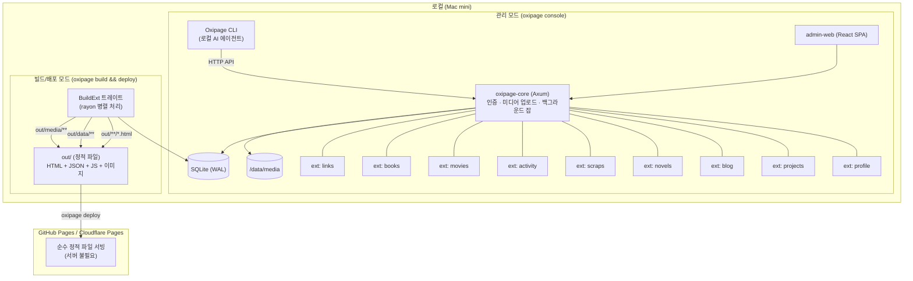
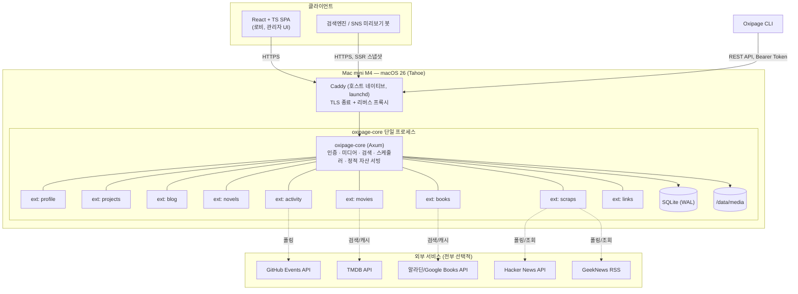

# 1장 — 시스템 아키텍처 (v2 Static Site Generator)

## 1.1 전체 개관 (v2)

> **Decision: v1 → v2 Architecture Change (2026-07-28)**
> 
> Oxipage pivots from a dynamic server-side rendered application to a **Static Site Generator**.
> 
> - **Content management**: CLI + `oxipage console` (admin-web) + SQLite — unchanged, runs locally
> - **Public site**: generated by `oxipage build` → static HTML + JSON + JS → deployed via `oxipage deploy` → no runtime server
> - **Why**: zero operating cost, deploy anywhere (GitHub Pages, Cloudflare Pages, Netlify), no security surface, no server dependency
>
> Full spec: `docs/superpowers/specs/2026-07-28-static-site-generator-design.md`



### v1 아키텍처 (이전 모델, 참고용)

이전 버전은 단일 프로세스가 API·정적 자산·스케줄러를 모두 담당했습니다. 아래는 v1의 개관도:



## 1.2 코어와 확장의 경계

**코어(`oxipage-core`)가 제공하는 것:**

- HTTP 서버 부트스트랩 (Axum 라우터 조합, 미들웨어: 로깅, CORS, 레이트리밋, 인증)
- 인증 (API 토큰 발급/검증, 관리자 세션)
- 미디어 저장소 (이미지 업로드 저장, 리사이즈/썸네일, `/data/media` 관리)
- 전문 검색 인덱스 (SQLite FTS5, 확장이 인덱싱 대상 문서를 등록)
- 백그라운드 잡 스케줄러 (`tokio-cron-scheduler`)
- 확장 레지스트리 (활성화된 확장 목록, 마이그레이션 실행 순서, 로비 매니페스트 조립)
- 설정 로딩 (`oxipage.toml` / 환경변수)
- SSR 스냅샷 렌더러 (SEO/OG 카드용, §1.6)
- **빌드 파이프라인 (v2):** `BuildExt` 레지스트리, rayon 병렬 처리, 정적 HTML + JSON 파일 출력
- **배포 명령 (v2):** `oxipage deploy` — GitHub Pages 1순위 (git worktree 기반)
- 관측성 (구조화 로깅 via `tracing`, `/healthz`, graceful shutdown, 부팅 시 `oxipage.toml`/환경변수 검증 및 **필수 외부 API 키 누락 경고**)
- 무거운 작업 분리 (이미지 리사이즈·썸네일·OG 스크랩 등 CPU 집약 작업은 동기 요청 스레드를 잡지 않고 `spawn_blocking` 또는 백그라운드 잡 큐로 위임 — 미디어 업로드는 즉시 원본 저장 후 리사이즈는 비동기)

**확장(`oxipage-ext-*`)이 제공하는 것:**

- 자기 도메인의 DB 스키마 + 마이그레이션
- 자기 도메인의 REST 라우트 (`/api/v1/blog/**` 등)
- 자기 도메인의 CLI 서브커맨드 (`oxipage blog ...`)
- (선택) 백그라운드 잡 (GitHub 폴링, TMDB 캐시 갱신 등)
- 로비에 보여줄 요약 카드 데이터 제공자
- 프론트엔드: 자기 라우트에 해당하는 React 코드 스플릿 청크

## 1.3 Rust 워크스페이스 구조

```
oxipage/
├── Cargo.toml                     # workspace 정의
├── crates/
│   ├── oxipage-core/             # 서버 부트스트랩, 인증, 미디어, 검색, 스케줄러, 확장 레지스트리, **BuildExt, 빌드 파이프라인**
│   ├── oxipage-cli/               # CLI 바이너리 (관리 + 빌드 + 배포 + 쿼리)
│   ├── oxipage-ext-profile/
│   ├── oxipage-ext-projects/
│   ├── oxipage-ext-blog/
│   ├── oxipage-ext-novels/
│   ├── oxipage-ext-scraps/
│   ├── oxipage-ext-activity/
│   ├── oxipage-ext-movies/
│   ├── oxipage-ext-books/
│   └── oxipage-ext-links/
├── migrations/                     # 확장별 하위 디렉토리로 네임스페이스 분리
├── web/                             # React + TS SPA (Vite)
│   └── src/
│       ├── lobby/                   # 로비 + 레이아웃 모드 렌더러
│       ├── extensions/
│       │   ├── projects/
│       │   ├── blog/
│       │   ├── novels/
│       │   ├── scraps/
│       │   ├── activity/
│       │   ├── movies/
│       │   ├── books/
│       │   └── links/
│       └── shared/                  # 디자인 토큰, 공통 컴포넌트(별점, 태그, 마크다운 렌더러)
├── deploy/
│   ├── Dockerfile                   # OCI 표준 → Apple `container build`도 그대로 사용 가능
│   ├── deploy.yaml                  # Oxipage 자체 배포 매니페스트 (컨테이너/볼륨/환경변수 선언)
│   └── Caddyfile.example
├── .agent/skills/oxipage/SKILL.md   # oh-my-pi 등 에이전트용 스킬
└── docs/                            # 본 설계 문서
```

## 1.4 `Extension` 트레이트 (설계 의도를 보여주는 의사코드)

```rust
#[async_trait]
pub trait Extension: Send + Sync {
    /// 고유 식별자. oxipage.toml의 enabled 목록, API 경로 프리픽스, 로비 매니페스트 키로 재사용됨
    fn id(&self) -> &'static str;

    fn display_name(&self, lang: Lang) -> String;

    /// 이 확장이 소유한 SQLite 마이그레이션 (독립 네임스페이스 테이블)
    fn migrations(&self) -> Vec<Migration>;

    /// /api/v1/{id}/** 하위에 마운트될 라우터
    fn routes(&self) -> Router<AppState>;

    /// `oxipage {id} ...` 서브커맨드 정의
    fn cli(&self) -> Option<clap::Command>;

    /// SEO용 SSR 스냅샷이 필요한 공개 경로들 (예: /blog/:slug)
    fn public_pages(&self) -> Vec<PageSpec>;

    /// GitHub 폴링, 외부 DB 캐시 갱신 등
    fn background_jobs(&self) -> Vec<Box<dyn ScheduledJob>>;

    /// 로비 카드에 표시할 요약 데이터 (최근 글 3개, 활동 스파크라인 등)
    async fn lobby_summary(&self, ctx: &AppState) -> Option<LobbyCard>;
}
```

> **디스패치 참고:** 위 의사코드의 `#[async_trait]`는 레지스트리가 `Box<dyn Extension>`으로 보관(dyn 디스패치)하기 위한 형태입니다. Rust 1.75+는 네이티브 `async fn in trait`을 지원하므로 정적 제네릭 호출 경로에서는 `async_trait` 크레이트 없이도 빌드되지만, 코어가 모든 확장을 동질적으로 다루려면 결국 erased/dyn 형태가 필요합니다. 이 레지스트리는 성능 민감하지 않으므로 `async_trait`(또는 `trait-erased`)를 그대로 두는 것이 실용적입니다.

**v1(현재 설계):** 이 트레이트를 구현하는 확장들은 전부 Cargo 워크스페이스 멤버로 컴파일 타임에 링크됩니다. `oxipage.toml`의 `enabled` 목록은 런타임에 "어느 확장의 라우트/잡/로비카드를 실제로 등록할지"만 제어합니다.

**Phase 2 방향성(리서치 스파이크, 상세 스펙은 범위 밖):** 동일한 트레이트 경계를 WASM 컴포넌트 모델 위에 올려, 호스트 함수(host function)로 미러링하면 서드파티가 재컴파일 없이 `oxipage extension install <name>`으로 확장을 설치할 수 있습니다. `wasmtime` 같은 런타임을 사용하되, DB 접근/네트워크 접근은 호스트가 중개하는 capability 기반 샌드박스로 제한하는 것을 전제로 합니다. **알려진 한계:** 런타임 설치 확장은 API 라우트·로비 카드·백그라운드 잡은 추가할 수 있지만 **CLI 서브커맨드는 추가할 수 없습니다** — CLI 바이너리는 컴파일 타임에 확장을 정적 링크해야 `clap::Command`를 조립(§1.4 `cli()`)하므로, 서드파티 WASM 확장은 CLI가 아니라 API/웹을 통해서만 다룰 수 있습니다. 이 한계는 명시적 설계 제약입니다. 이 부분은 5장에서 OSS 로드맵과 함께 다시 언급합니다.

## 1.5 프론트엔드 구조

- **빌드:** Vite + React + TypeScript
- **라우팅:** React Router. 최상위 경로는 코어가 내려주는 확장 매니페스트(`GET /api/v1/lobby/manifest`)를 읽어 동적으로 구성 — 확장이 꺼져 있으면 해당 라우트 자체가 등록되지 않음
- **데이터 페칭:** TanStack Query. **개발 모드**는 로컬 API, **프리뷰/프로덕션(v2)**은 빌드 시 생성된 정적 JSON 파일을 fetch. `VITE_DATA_MODE` 환경변수로 분기.
- **코드 스플리팅:** 확장 하나 = lazy route chunk 하나. 영화 확장을 안 쓰는 사람은 그 번들을 아예 받지 않음
- **디자인 토큰:** `web/src/shared/tokens.css` — OKLCH 커스텀 프로퍼티 (3장 상세)
- **마크다운 렌더링:** 블로그/소설/리뷰 본문은 전부 마크다운 저장 → 프론트에서 렌더 (예: `markdown-it` 계열 + 코드 블록 하이라이팅)

## 1.6 렌더링 전략 — "SPA + 발행 시점 스냅샷"

순수 SPA는 개발이 단순하지만 블로그/프로젝트 상세 페이지의 SEO와 SNS 공유 미리보기(OG 태그)가 약합니다. Node 기반 SSR(Next.js류)은 스택에 Node 런타임을 추가로 얹는 부담이 있고, 이 프로젝트는 이미 Rust가 API 서버 역할을 하고 있습니다.

그래서 다음 하이브리드를 채택합니다:

1. **인터랙티브 경험(로비, 관리자, 필터링/검색)은 순수 React SPA.**
2. **콘텐츠가 `publish`될 때**, 코어가 Askama(Rust 컴파일 타임 템플릿 엔진)로 해당 페이지의 **prerendered HTML**(제목·본문 텍스트·OG 메타·canonical 링크 + 동일 SPA 스크립트 태그 포함)을 생성해 `/data/snapshots/`에 저장합니다.
3. **콘텐츠 라우트(`/blog/:slug`, `/projects/:slug` 등)는 누구에게나 이 prerendered HTML을 캐논리컬로 서빙**합니다. 브라우저는 같은 HTML을 받아 하이드레이트되어 인터랙티브로 전환하고, JS를 실행하지 않는 OG 미리보기 봇(Slack/카카오톡/Twitter)과 대부분의 크롤러는 스냅샷 그대로를 봅니다. **User-Agent 기반 봇 판별은 쓰지 않습니다** — 봇 UA가 다양해 누락이 생기고, 구글처럼 JS를 렌더링하는 크롤러에겐 어차피 불필요하며, 미들웨어 한 층이 영구히 남는 비용이 더 큽니다.
4. 콘텐츠가 수정되면 스냅샷도 다시 생성됩니다. 스냅샷은 순수 파생 데이터이므로 언제든 재생성 가능(캐시 무효화만 신경 쓰면 됨).

이렇게 하면 Node SSR 없이도 검색엔진 색인과 카카오톡/슬랙 링크 미리보기가 정상 동작합니다.

> **v2 변경 (2026-07-28):** SSR 스냅샷을 빌드 시점으로 확장합니다. `oxipage build`가 모든 published 콘텐츠의 정적 HTML을 일괄 생성하고, React SPA가 그 위에서 하이드레이트됩니다. 개별 publish 시점 스냅샷 생성 대신 `BuildExt.build_pages()`가 전체 목록을 생성합니다.

## 1.7 데이터 저장

- **기본 DB: SQLite** (`sqlx` + WAL 모드). 이유: 단일 파일 백업/복구가 쉽고, 단일 바이너리·단일 프로세스 배포와 잘 맞고, 개인 사이트 트래픽 규모에서 성능상 아무 문제가 없습니다.
- **확장성 여지:** 리포지토리 레이어를 트레이트로 추상화해 두면(`ProjectRepo`, `BlogRepo` 등), 나중에 대규모 자기소개 사이트 트래픽이 생기거나 OSS 사용자가 Postgres를 원할 때 어댑터만 추가하면 됩니다. v1에서는 Postgres 어댑터를 실제로 구현하지 않습니다(YAGNI).
- **미디어(이미지/스크린샷):** 로컬 파일시스템 `/data/media/{extension}/{id}/...`. OSS화 단계에서 S3 호환(MinIO 등) 어댑터를 옵션으로 추가할 수 있게 저장소 인터페이스만 추상화해 둡니다.
- **전문 검색:** SQLite FTS5 가상 테이블(`tokenize='trigram'` 적용 — 한국어 등 CJK에서 기본 `unicode61` 토크나이저가 공백 기반 분리로 검색 품질이 처찰하므로 부분문자열 매칭이 잘 되는 trigram을 채택. 인덱스 크기는 커지지만 1인 규모에선 체감상 미미. 품질이 더 필요해지면 `fts5-icu-tokenizer`(한국어 명시 지원)로 교체 여지를 둠). 확장은 `search_documents(extension_id, doc_id, title, body, lang, published_at)` 공통 인덱스에 자기 콘텐츠를 upsert하기만 하면 전역 검색(`/search?q=`)에 자동으로 잡힙니다. **확장 비활성화 시 해당 `extension_id`의 행을 즉시 인덱스에서 동기 삭제**해야 합니다(§2.13) — daily 정리 잡(§1.9)과 별개로 disable 이벤트에 즉시 처리.

> **v2 변경 (2026-07-28):** 관리 모드에서는 FTS5로 인덱싱하고, `BuildExt.build_search_docs()`가 인덱스 결과를 정적 JSON으로 덤프합니다. 프로덕션 사이트에서 검색은 클라이언트가 이 JSON을 받아 `String.includes()`로 필터링합니다.

## 1.8 인증

v1은 "1 인스턴스 = 1 오너" 전제이므로 계정 시스템을 최소화합니다.

- **CLI/API용:** Personal Access Token(PAT). `oxipage auth token create --label "omp-agent" --scopes post:write`로 발급. **PAT는 ≥256비트 난수 고엔트로피 토큰이므로 매요청 조회에 쓰는 빠른 해시(SHA-256 또는 HMAC-SHA256)로만 저장**합니다(느린 해시를 쓰면 쓰기 API마다 비용이 누적되어 DoS를 자초). 클라이언트는 최초 1회만 평문을 받고, 요청은 `Authorization: Bearer <token>` 헤더로 보냅니다.
- **웹 관리자 UI용(있다면, 후순위 §6):** 비밀번호 1개(Argon2id 해시) + 세션 쿠키(HttpOnly, SameSite=Strict) + CSRF 토큰.
- **공개 읽기 API**(블로그 목록 조회 등)는 인증 불필요. 쓰기 API는 전부 토큰 필요.
- Phase 2(멀티유저 SaaS화)는 명시적으로 범위 밖(§0.6)이므로 이 인증 모델을 억지로 확장하지 않습니다.

## 1.9 백그라운드 잡

`tokio-cron-scheduler` 기반 스케줄러를 코어가 하나 띄우고, 각 확장이 `background_jobs()`로 등록한 잡을 실행합니다.

| 잡 | 소유 확장 | 주기 | 비고 |
|---|---|---|---|
| GitHub 활동 동기화 | `activity` | webhook 즉시 + 15분 폴링(보조) | GitHub webhook(`push`/`release`/`pull_request`)을 1순위로 즉시 upsert; Events API 폴링은 누락 보정용 보조(§2.8) |
| HN/GeekNews 신규 글 체크 | `scraps` | 30분 | 사용자가 수동 `scrap add`할 때 즉시 갱신도 가능, 주기 폴링은 "추천 큐" 용도 |
| TMDB/알라딘 메타데이터 캐시 갱신 | `movies` / `books` | 주 1회 | 포스터 URL 만료 등 대비, 실패해도 기존 캐시로 폴백 |
| 검색 인덱스 정합성 점검 | 코어 | 일 1회 | 고아 인덱스 정리 |
| 스냅샷 재생성 큐 소진 | 코어 | 상시(큐 기반) | §1.6 |

**GitHub 활동은 webhook 우선(§2.8):** Cloudflare Tunnel(5장)이 공개 엔드포인트를 주므로 이벤트 발생 즉시 POST를 받습니다. Events API는 최근 30일·최대 300개·30~90초 지연 한계가 있어 폴링 단일 경로로는 유실을 막을 수 없기 때문에 보조로만 씁니다.

모든 외부 API 연동은 **키가 없으면 조용히 비활성화**되어야 합니다(예: `OXIPAGE_TMDB_KEY` 미설정 시 영화 확장은 수동 입력만 지원). 이는 OSS 사용자가 원하는 통합만 골라 쓸 수 있게 하기 위한 원칙입니다.

> **v2 변경 (2026-07-28):** 상시 서버를 가정한 백그라운드 잡은 `oxipage cache refresh` 명령으로 대체됩니다. 빌드 시점에 외부 API를 호출하지 않고, 별도 명령으로 수집된 데이터를 DB에 기록한 후 `build`가 읽습니다.

## 1.10 v2 — Static Site Generator 모델 (2026-07-28)

상시 서버를 정적 사이트 생성기로 전환합니다. 관리와 배포의 관심사를 분리합니다.

### 1.10.1 다섯 가지 모드

| 모드 | 명령 | 목적 |
|---|---|---|
| 관리 | `oxipage console` | admin-web + API 서버 (로컬 전용) |
| 빌드 | `oxipage build` | DB → 정적 HTML + JSON 생성 |
| 배포 | `oxipage deploy` | 정적 파일 → GitHub Pages/Cloudflare Pages/Netlify |
| 캐시 | `oxipage cache refresh` | 외부 API(GitHub, TMDB, 알라딘) 수집 |
| SQL 질의 | `oxipage query "<SQL>"` | AI 에이전트용 직접 DB 조회 |

### 1.10.2 `BuildExt` 트레이트

기존 `Extension` 트레이트(관리 모드)에 `BuildExt` 트레이트(빌드 모드)를 추가합니다. 빌드는 CPU 바운드 작업(async 불필요)이며, rayon으로 각 확장을 병렬 처리합니다.

```rust
pub trait BuildExt {
    type Error: std::error::Error + Send + 'static;

    fn build_pages(&self, db: &SqlitePool) -> Result<Vec<StaticPage>, Self::Error>;
    fn build_data(&self, db: &SqlitePool) -> Result<Box<dyn erased_serde::Serialize>, Self::Error>;
    fn build_search_docs(&self, db: &SqlitePool) -> Result<Vec<SearchDoc>, Self::Error>;
}
```

### 1.10.3 배포 흐름

`oxipage deploy --target github-pages`가 내부적으로 git worktree를 사용해 `gh-pages` 브랜치에 `out/`을 푸시합니다. 서버 프로세스 관리(launchd/systemd)가 더 이상 필요하지 않습니다.
