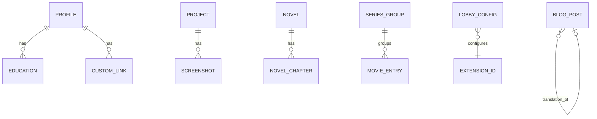
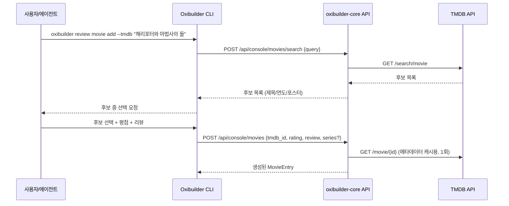

# 2장 — 도메인 모델

각 확장은 자기 테이블에만 쓰고 읽습니다(다른 확장 테이블을 직접 JOIN하지 않음 — 필요하면 코어 API를 통해 조합). 아래 스키마는 SQLite 기준이며, 필드명은 실제 마이그레이션 작성 시 그대로 컬럼명으로 써도 되는 수준으로 구체화했습니다.

## 2.1 공통 값 객체

| 이름 | 설명 |
|---|---|
| `Rating` | 별점. `0` ~ `10` 정수로 저장(0.5점 단위 = 정수 1스텝), 프론트에서 `/2.0`으로 환산해 `0.0`~`5.0`점 별 5개로 렌더링. 영화·책 확장이 공유. (구 버전 문서의 "0~20"은 모순이라 `0~10`을 정규 계약으로 채택 — rating.rs 주석 참고) |
| `LocalizedText` | 이중언어 필드는 JSON 객체(`{ko, en}`)가 아니라 **별도의 nullable 컬럼**(`title_ko`, `title_en` 식)로 표현합니다. FTS5 인덱스·SQL 쿼리·마이그레이션이 단순하고 어느 쪽이 채워졌는지 컬럼 단위로 NULL 체크/인덱스가 가능하기 때문. 최소 하나는 필수인지는 확장마다 다름(§2.14 정책 표 참고). ko/en을 넘어 언어 추가 가능성이 커지면 그때 JSON 컬럼 전환을 재검토. |
| `Tag` | 각 확장 테이블에 `tags` 컬럼(JSON 배열)로 단순 저장. 태그 마스터 테이블은 v1에서는 두지 않음(YAGNI, 필요해지면 정규화) |

## 2.2 ERD 개관

(도서 `BOOK_ENTRY`, 스크랩 `SCRAP_ITEM`, 활동 `ACTIVITY_EVENT`, 링크 `LINK_CARD`는 다른 테이블과 강한 관계가 없는 독립 엔티티라 다이어그램에서는 생략했습니다. 아래 표에서 전부 다룹니다.)

## 2.3 `profile` — 소개 명함 / 포트폴리오

싱글턴(row 하나만 존재). **명시된 요구사항대로 이메일/학력/GitHub/LinkedIn 전부 선택(nullable)이며, 강제되는 필드는 `display_name` 뿐입니다.**

| 필드 | 타입 | 필수 |
|---|---|---|
| `display_name` | text | ✅ |
| `tagline_ko` / `tagline_en` | text | ❌ |
| `avatar_url` | text | ❌ |
| `bio_ko` / `bio_en` | markdown | ❌ |
| `email` | text | ❌ |
| `github_username` | text | ❌ |
| `linkedin_url` | text | ❌ |
| `education[]` | `{institution, degree, field, start_year, end_year}[]` (JSON) | ❌ 항목 전체 및 개별 필드 모두 선택 |
| `custom_links[]` | `{label, url, icon?}[]` (JSON) | ❌ |

## 2.4 `projects` — 프로젝트 / 서비스 / 앱 포트폴리오

요구사항상 **이중언어 설명이 구조적으로 지원**되어야 하는 유일한 확장입니다.

| 필드 | 타입 | 비고 |
|---|---|---|
| `id`, `slug` | | |
| `title_ko` / `title_en` | text | 스키마상 둘 다 컬럼 존재. 값은 하나만 채워도 저장 가능하지만 CLI가 둘 다 입력하도록 유도 |
| `description_ko` / `description_en` | markdown | 상동 |
| `tech_stack[]` | text[] (JSON) | 예: `["Rust", "React", "TypeScript"]` |
| `status` | enum `active \| archived \| wip` | |
| `started_at` / `ended_at` | date, nullable | |
| `links` | `{repo?, demo?, app_store?, play_store?, custom: [{label,url}]}` (JSON) | 전부 선택 |
| `featured` | bool | 로비 카드 상단 고정용 |
| `screenshots[]` | 별도 테이블 `screenshot(id, project_id, url, alt_ko, alt_en, order)` | 순서 있는 갤러리 |

## 2.5 `novels` — 소설

| 엔티티 | 필드 |
|---|---|
| `Novel` | `id`, `slug`, `title`, `synopsis`(markdown, nullable), `cover_image`(nullable), `status: ongoing \| completed \| hiatus`, `tags[]` |
| `NovelChapter` | `id`, `novel_id`, `order`, `title`, `body`(markdown), `char_count`(공백 제외 자수, 자동 계산 — 한국어는 공백 단어 분리가 불규칙해 word count 대신 자수를 씀), `published_at`(nullable → draft) |

소설은 개인 창작물 특성상 이중언어를 강제하지 않습니다(필요하면 `Novel.title_en` 같은 선택 필드를 나중에 추가하는 정도로 충분).

## 2.6 `blog` — 블로그

| 필드 | 타입 | 비고 |
|---|---|---|
| `id`, `slug` | | |
| `title` | text | |
| `body` | markdown | |
| `lang` | enum `ko \| en` | 글 하나는 한 언어로 작성 |
| `translation_group_id` | nullable FK(self) | 같은 내용의 번역본들을 묶는 용도. "이 글의 영어판" 링크에 사용 |
| `tags[]` | text[] | |
| `published_at` | nullable | null이면 초안 |

블로그는 프로젝트와 달리 **매 글마다 이중언어를 강제하지 않고**, 번역하고 싶을 때만 별도 글로 쓰고 `translation_group_id`로 묶는 느슨한 모델을 택했습니다. 매번 두 언어를 쓰게 강제하면 발행 빈도가 떨어질 위험이 크기 때문입니다.

## 2.7 `scraps` — 해커뉴스 / 긱뉴스 스크랩

| 필드 | 타입 | 비고 |
|---|---|---|
| `id` | | |
| `source` | enum `hackernews \| geeknews \| manual` | |
| `source_item_id` | nullable text | HN item id 등 원본 식별자 |
| `source_url` | text | |
| `title` | text | 원본에서 자동 수집 또는 수동 오버라이드 |
| `og_image_url` | nullable | |
| `note_ko` / `note_en` | markdown, nullable | 개인 코멘트, 둘 다 선택 |
| `tags[]` | | |
| `scraped_at` | timestamp | |

**수집 방식:** Hacker News는 공식 Firebase 기반 API(`https://github.com/HackerNews/API`)로 아이템 메타데이터를 가져옵니다. GeekNews(news.hada.io)는 RSS 피드를 제공하므로 RSS를 파싱해 신규 글을 감지합니다. 두 소스 모두 "background job이 새 글 후보를 가져와 큐에 쌓아두고, 사용자가 `oxibuilder scrap add`로 그중 하나를 골라 코멘트를 붙여 발행"하는 흐름이며, 자동으로 스크랩이 게시되지는 않습니다(원칙: 발행은 항상 사람의 선택).

## 2.8 `activity` — 최근 활동(Git 커밋 등)

읽기 전용 캐시 테이블입니다. 사용자가 직접 쓰지 않고 백그라운드 잡이 채웁니다.

| 필드 | 타입 | 비고 |
|---|---|---|
| `id` | | |
| `repo_full_name` | text | 예: `myid/oxibuilder` |
| `event_type` | enum `push \| pull_request \| issues \| release \| star \| ...` | GitHub Events API의 이벤트 타입 매핑 |
| `summary` | text | 사람이 읽기 좋게 가공한 한 줄 요약 |
| `url` | text | |
| `occurred_at` | timestamp | |
| `synced_at` | timestamp | |

GitHub의 공개 Events API만 사용하므로 **비공개 저장소의 활동은 절대 노출되지 않습니다**(설계상 보장 — private repo 이벤트는 애초에 이 API로 조회되지 않음).

**수집 경로:** GitHub webhook(`push`/`release`/`pull_request` 등)을 1순위로 사용합니다 — Cloudflare Tunnel(5장)이 공개 엔드포인트를 이미 제공하므로 이벤트 발생 즉시 POST를 받아 upsert합니다. Events API 폴링은 보조(webhook 누락 보정·과거 백필)로만 씁니다. 이중 경로인 이유는 Events API가 **최근 30일·최대 300개** 이벤트만 반환하고 30~90초 지연이 있어, 폴링 단일 경로로는 서버 다운 중 이벤트 유실과 활발한 사용자의 300개 초과분 유실을 막을 수 없기 때문입니다(§1.9).

## 2.9 `movies` — 영화/시리즈 리뷰

두 엔티티로 "개별 작품 평가"와 "프랜차이즈 통합 평가"를 **독립적으로 공존**시킵니다 — 시리즈 묶음 평가는 선택 기능이지 개별 평가를 대체하지 않습니다.

**`MovieEntry`**

| 필드 | 타입 | 비고 |
|---|---|---|
| `id` | | |
| `tmdb_id` | nullable | 수동 입력(TMDB에 없는 작품)이면 null |
| `media_type` | enum `movie \| tv` | TV는 시즌/에피소드 세분화 없이 "작품 단위" |
| `title`, `poster_path`, `release_year` | | TMDB에서 캐시해온 값 |
| `watched_at` | date | |
| `rating` | `Rating` (0~10) | |
| `review_ko` / `review_en` | markdown, nullable | |
| `rewatch` | bool | |
| `series_group_id` | nullable FK → `SeriesGroup` | |
| `series_order` | nullable int | 그룹 내 정렬(개봉 순 등) |

**`SeriesGroup`**

| 필드 | 타입 | 비고 |
|---|---|---|
| `id`, `slug` | | |
| `title_ko` / `title_en` | text | 예: "해리포터", "Harry Potter" |
| `cover_image` | nullable | |
| `group_rating` | `Rating`, nullable | 시리즈 전체에 대한 통합 평점(선택) |
| `group_review_ko` / `group_review_en` | markdown, nullable | |

**TMDB 연동 흐름:**

TMDB API 사용 시 TMDB의 attribution 요구사항(예: "This product uses the TMDB API but is not endorsed or certified by TMDB" 문구 표기)을 프론트엔드 푸터 등에 반영해야 합니다. 정확한 현재 문구/조건은 구현 시점에 TMDB 이용약관에서 재확인을 권장합니다.

## 2.10 `books` — 도서 리뷰

| 필드 | 타입 | 비고 |
|---|---|---|
| `id` | | |
| `source` | enum `aladin \| google_books \| open_library \| manual` | |
| `external_id` / `isbn13` | nullable | |
| `title`, `author`, `cover_image_url` | | 외부 API에서 캐시 |
| `rating` | `Rating` (0~10) | |
| `review_ko` / `review_en` | markdown, nullable | |
| `status` | enum `wishlist \| reading \| completed \| dropped` | |
| `started_at` / `finished_at` | date, nullable | |

**외부 도서 DB 선택:** 한국어 도서 커버리지가 중요하므로 **알라딘 OpenAPI**(TTBKey 필요, 한국 도서 커버/메타데이터 우수)를 1순위로, 영문 도서나 알라딘에 없는 항목은 **Google Books API**를 폴백으로 둡니다. 두 API 모두 키가 없으면 해당 소스 검색이 비활성화되고 `manual` 입력만 가능하게 해, 개발 초기에도 기능이 완전히 막히지 않게 합니다.

## 2.11 `links` — 생태계 링크 전시

가장 자유도가 높은 확장입니다. 다른 랜딩 페이지, 사이드 프로젝트, 실험적인 웹페이지 등을 큐레이션합니다.

| 필드 | 타입 | 비고 |
|---|---|---|
| `id` | | |
| `title` | text | |
| `url` | text | |
| `description_ko` / `description_en` | text, nullable | |
| `thumbnail_url` | nullable | 수동 업로드 또는 OG 이미지 스크래핑 |
| `tags[]` | | |
| `display_order` | int | |
| `featured` | bool | |

## 2.12 `LobbyConfig` — 로비 표시 설정

코어 소유 테이블(확장이 아니라 로비 자체의 설정). 3장에서 다루는 3가지 레이아웃 모드를 확장별로 지정합니다.

| 필드 | 타입 | 비고 |
|---|---|---|
| `extension_id` | text (PK) | |
| `enabled` | bool | |
| `display_mode` | enum `canvas \| grid \| list` | |
| `order` | int | 로비 내 노출 순서 |
| `style_params` | JSON | 모드별 자유 파라미터(예: canvas의 흔들림 강도, grid의 컬럼 수) |

## 2.13 확장 비활성화 데이터 라이프사이클

`oxibuilder extension disable <name>`(§4.3)과 `LobbyConfig.enabled=false`(§2.12)의 데이터 의미를 명확히 합니다. **v1은 soft-disable을 기본 동작**으로 합니다:

- **유지:** 확장의 DB 테이블 행과 `/data/media/{extension}/` 파일은 그대로 둡니다.
- **즉시 해제:** 라우트 마운트 해제, 백그라운드 잡 등록 해제, 로비 카드에서 제외 → 비활성화된 확장의 API·페이지는 404, 로비에서 사라짐.
- **공유 FTS 인덱스 즉시 정리:** `search_documents`에서 해당 `extension_id`의 행을 **동기 삭제**(§1.7). daily 정리 잡(§1.9)을 기다리지 않습니다 — 그렇지 않으면 비활성화된 확장의 문서가 `/search`에 잠깐 노출됩니다.
- **재활성화:** 데이터가 그대로 있으므로 enable 시 라우트·잡·인덱스를 다시 등록하기만 하면 복구(스냅샷·FTS는 파생 데이터라 필요시 재생성).
- **완전 삭제(hard purge):** 별도 명령 `oxibuilder extension purge <name>`으로만 — 테이블 DROP + 미디어 디렉토리 삭제 + 인덱스 정리. 실수 방지를 위해 `disable`과 분리하고 확인 프롬프트를 둡니다.

## 2.14 이중언어 정책 요약

| 확장 | 이중언어 정책 |
|---|---|
| `projects` | **구조적 강제** — 스키마에 항상 ko/en 컬럼 존재 |
| `profile` | 구조적 지원, 값은 선택 |
| `movies` / `books` / `scraps` | 리뷰/노트에 ko/en 필드 존재하되 둘 다 선택 |
| `blog` | 글 단위로 언어 선택 + `translation_group_id`로 느슨하게 연결 |
| `novels` / `links` | 기본 단일 언어, 필요 시 나중에 선택 필드 추가 |
