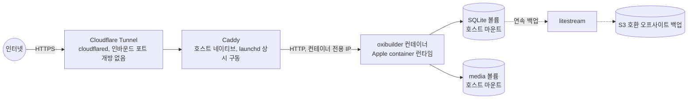

# 5장 — 셀프호스팅 배포

> **v2 변경 (2026-07-28):** Oxibuilder는 정적 사이트 생성기(SSG)로 전환되었습니다.
> 공개 사이트를 위해 서버를 실행할 필요가 없습니다. `oxibuilder build && oxibuilder deploy`로
> GitHub Pages, Cloudflare Pages, Netlify 등에 정적 파일을 배포하세요.
> 이 장은 v1 상시 서버 모델의 배포 가이드로, 기록용으로 보존됩니다.
> SSG 배포 가이드는 `README.md`와 설계 문서를 참고하세요.

## 5.1 전제: Apple `container`의 현재 상태 (2026년 7월 기준)

설계 전에 Apple의 `container` 툴 현황을 확인했습니다. 배포 아키텍처는 이 제약을 그대로 반영합니다.

- macOS 26(Tahoe) + Apple Silicon 필수. **Mac mini M4는 조건을 만족**하지만, macOS 26으로 업데이트되어 있어야 합니다.
- 2026년 6월 9일 `v1.0.0`으로 정식(stable) 릴리스 — CLI/API가 고정됨
- 컨테이너마다 독립된 경량 VM(Virtualization.framework 기반)에서 실행되는 "VM-per-container" 구조라 격리 수준이 높음
- OCI 표준 호환 — Docker Hub/GHCR의 표준 이미지를 그대로 pull/run 가능, `container build`로 이미지 빌드도 가능(BuildKit 기반)
- **`docker compose`에 해당하는 네이티브 멀티 컨테이너 오케스트레이션은 아직 없음.** 서드파티 도구(예: `Container-Compose`)가 이 공백을 메우고 있지만 아직 커버리지가 제한적입니다.

**설계 결정:** 배포의 기본 단위는 **단일 Rust 바이너리**입니다(프론트엔드 내장). Apple `container`/Docker는 *선택적* 포장이지 필수가 아닙니다 — 기본 실행 모델은 바이너리를 launchd(macOS)/systemd(Linux)로 직접 기동하는 것입니다. 다만 §1.1에서 정한 대로 '앱 전체가 단일 프로세스' 구조이므로 container를 쓰더라도 컨테이너 하나면 충분하며, Apple `container`가 compose를 지원하지 않는 것은 실질적 문제가 되지 않습니다. SQLite 기본 DB 선택(§1.7)도 별도 DB 컨테이너가 없어서 되는 일입니다.

## 5.2 배포 토폴로지



- **Caddy는 컨테이너화하지 않고 macOS 호스트에 네이티브로(`brew install caddy` + launchd)** 둡니다. 지금 시점에 Apple `container`로 리버스 프록시까지 컨테이너 2개로 오케스트레이션하려면 아직 미성숙한 서드파티 compose 도구에 의존해야 하는데, TLS 종료 역할 하나만 하는 Caddy를 굳이 컨테이너에 넣을 이유가 없습니다. Apple `container`가 compose를 네이티브 지원하게 되면 이 부분은 쉽게 컨테이너로 옮길 수 있도록, Caddy 설정 자체는 처음부터 독립 파일(`deploy/Caddyfile.example`)로 관리합니다.
- **Cloudflare Tunnel(`cloudflared`)** 로 홈 네트워크 공유기의 포트 포워딩 없이 외부에 노출합니다. 가정용 회선에 인바운드 포트를 여는 것 자체가 불필요한 공격 표면이므로, 이미 많이 쓰이는 이 패턴을 기본값으로 권장합니다.
- 컨테이너는 Apple `container`의 "컨테이너별 고정 IP" 특성을 활용해 포트 매핑 없이 Caddy가 그 IP로 바로 프록시합니다.
- **기본 실행 모델:** `oxibuilder-console` 바이너리를 launchd(macOS, `deploy/oxibuilder.plist.example`) 또는 systemd(Linux, `deploy/oxibuilder.service.example`)로 직접 기동하는 것이 기본 경로입니다. container를 쓰는 경우에도 Caddy→컨테이너 흐름은 동일합니다. OSS 사용자(§5.7)가 Apple Silicon/macOS 없이도 Linux 서버 한 대에서 동일하게 운영할 수 있는 것도 이 경로 덕분입니다.

## 5.3 이미지 빌드 및 실행 (예시, 정확한 플래그는 구현 시점의 `container --help`로 재확인)

> 이 절은 **container 패키징을 선택한 경우**의 경로입니다. 바이너리 직접 기동이 기본(§5.2)이므로, container를 쓰지 않으면 이 절을 건너뛰고 launchd/systemd 경로를 따릅니다.

```dockerfile
# deploy/Dockerfile — 표준 OCI 문법이므로 Apple `container build`에서도 그대로 사용
FROM rust:1-slim AS build
WORKDIR /app
COPY . .
RUN cargo build --release -p oxibuilder-console

FROM debian:stable-slim
COPY --from=build /app/target/release/oxibuilder-console /usr/local/bin/oxibuilder-console
# 프론트엔드(web/dist)는 rust-embed로 이미 바이너리에 내장되어 별도 COPY 불필요
EXPOSE 8787
ENTRYPOINT ["/usr/local/bin/oxibuilder-console"]
```

```bash
container build -t oxibuilder:latest -f deploy/Dockerfile .

container run -d \
  --name oxibuilder \
  -v ~/oxibuilder-data/db:/data/db \
  -v ~/oxibuilder-data/media:/data/media \
  --env-file ~/oxibuilder-data/.env \
  oxibuilder:latest
```

- `rust-embed` 크레이트로 `web/dist`(Vite 빌드 산출물)를 Rust 바이너리에 컴파일 타임 내장 → **이미지 하나 = 프론트엔드 + 백엔드 전부.**
- `.env`에는 `OXIBUILDER_TMDB_KEY`, `OXIBUILDER_ALADIN_TTBKEY`, `OXIBUILDER_ADMIN_PASSWORD_HASH` 등 비밀 값만 둡니다.
- `oxibuilder deploy` CLI 명령(4장)은 이 빌드+실행 시퀀스를 감싸는 얇은 래퍼입니다.

## 5.4 데이터 영속성과 백업

- SQLite DB 파일과 `/data/media`는 호스트 디렉토리에 볼륨 마운트 — 컨테이너/프로세스를 지우고 새로 만들어도 데이터 유지
- **SQLite 연속 백업:** `litestream`으로 WAL을 S3 호환 스토리지(Cloudflare R2, Backblaze B2 등)에 실시간 스트리밍. litestream은 현재 Fly.io 소관이고 커뮤니티 활동이 뜸해 단일 의존성 리스크가 있으므로, **폴백으로 주기적 `VACUUM INTO` 스냅샷 + restic/rclone 동기화**를 병행 권장.
- **미디어·스냅샷 백업(별도):** litestream은 SQLite만 커버하므로 `/data/media`(업로드 이미지, 원본)는 restic/rclone으로 R2/B2에 별도 동기화(반드시). `/data/snapshots`(SSR 스냅샷)는 파생 데이터라 재생성 가능하므로 낮은 빈도여도 됩니다.
- **수동 스냅샷:** `oxibuilder backup export`로 DB + media를 tar로 묶어 임의 시점 백업(예: 큰 구조 변경 전)
- 복구 절차는 "컨테이너 중지 → litestream restore 또는 tar 압축 해제 → 볼륨 경로에 배치 → 컨테이너 재시작"으로 문서화(운영 매뉴얼은 이 설계 문서 범위 밖이지만, README에 반드시 명시)

## 5.5 보안 체크리스트

- 인바운드 포트 미개방(Cloudflare Tunnel), TLS는 Cloudflare 또는 Caddy 자동 인증서
- 관리자 비밀번호는 Argon2id 해시로만 저장, PAT는 해시로만 저장(§1.8)
- 컨테이너 격리: Apple `container`의 VM-per-container 구조 자체가 공유 커널 기반 컨테이너보다 격리 수준이 높다는 점을 알고 있되, 이를 "그러니 취약점 관리를 안 해도 된다"는 근거로 쓰지 않음 — 기본 위생(의존성 업데이트, 최소 권한 컨테이너 실행)은 그대로 유지
- 외부 API 키는 전부 `.env`에만, git에는 절대 커밋되지 않도록 `.gitignore`에 명시

## 5.6 향후 멀티 컨테이너가 필요해질 때

미디어 처리 워커, 별도 검색 엔진 등으로 컨테이너가 늘어나야 하는 시점이 오면:

1. 우선 서드파티 `Container-Compose`류 도구의 성숙도를 재확인
2. **`deploy/deploy.yaml`(Oxibuilder 자체 매니페스트)은 지금부터 단일 프로세스 배포의 단일 진실 소스로 씁니다** — 서비스·볼륨·환경을 선언하고, `oxibuilder deploy`는 이를 읽어 (a) 바이너리 직접 기동(launchd/systemd) 또는 (b) `container run` 중 선택한 모드로 실행합니다. compose-spec과 유사한 키 이름을 써서, Apple이 공식 compose를 추가하면 표준 `compose.yaml`로 거의 그대로 변환 가능합니다.

## 5.7 OSS 셀프호스팅 제품으로의 일반화 경로

**전제 재확인(§0.3):** 멀티테넌트 SaaS가 아니라 "각자 자기 인스턴스를 돌린다" 모델을 유지합니다. 이 결정 덕분에 일반화 작업은 생각보다 작습니다 — 이미 설정 기반(`oxibuilder.toml`)이고 확장은 켜고 끌 수 있으니, 남은 일은 아래 정도입니다.

1. **개인화 요소 제거:** 이름/문구 등 하드코딩된 부분을 전부 `oxibuilder.toml` 또는 `profile`로 이동
2. **확장 레지스트리:** 초기에는 GitHub 저장소 하나에 curated JSON 인덱스(`{name, repo, description, version}[]`)를 두는 정도로 단순하게 시작 — Homebrew tap과 비슷한 방식. `oxibuilder extension install <name>`이 이 인덱스를 조회해 설치
3. **템플릿 저장소:** `oxibuilder-starter` 레포를 만들어 `git clone` + 원클릭 설치 스크립트(`curl ... | sh`)로 남이 바로 시작할 수 있게 함
4. **확장 SDK 문서화:** 1장 §1.4의 `Extension` 트레이트를 안정된 공개 인터페이스로 문서화 — 최소한 "새 확장을 만드는 법" 가이드 하나는 필요
5. **WASM 플러그인화(리서치 스파이크):** 서드파티가 코어를 재컴파일하지 않고 확장을 설치하게 하려면 결국 §1.4에서 언급한 WASM 컴포넌트 경계가 필요합니다. v1~v2에서는 우선 컴파일 타임 확장으로 충분히 검증한 뒤, 실제로 "남이 만든 확장을 설치하고 싶다"는 수요가 확인되면 이 스파이크를 진행하는 순서를 권장합니다(6장 로드맵 Phase 5).
6. **라이선스:** MIT 또는 Apache-2.0 권장(oh-my-pi 등 인접 생태계 도구들과 라이선스 궁합이 좋음). 최종 선택은 소유자 몫.
