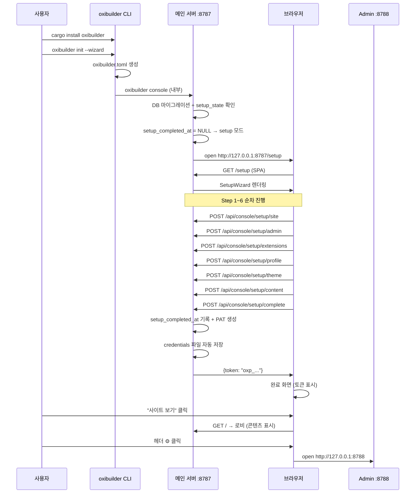

# 13장 — 첫 부팅 UX (First-Run Setup Wizard)

> 2026-07-28 작성. `cargo install oxibuilder` → 브라우저에서 초기 설정 완료까지
> **한 번의 흐름**으로 끝나는 UX를 설계한다.

## 13.1 문제 정의

현재 `cargo install`부터 "블로그가 보이는 상태"까지 사용자가 겪는 경로:

```
cargo install oxibuilder-cli          # ← 패키지명 불일치 (oxibuilder 아님)
oxibuilder init                       # ← TOML 생성 (profile만 enabled)
export OXIBUILDER_ADMIN_TOKEN=xxx     # ← 어디서? 어떻게?
oxibuilder console                      # ← 서버 기동
# 브라우저 수동 오픈 http://127.0.0.1:8787
# 빈 로비만 보임 — 뭘 해야 할지 모름
# admin 콘솔? oxibuilder admin? 별도 포트?
# CLI로 blog new? 토이 없어서 401
```

**6개의 구멍:**
1. `cargo install oxibuilder` 실패 (crate명 = `oxibuilder-cli`)
2. `oxibuilder open` / 브라우저 자동 오픈 없음
3. 첫 부팅 감지 + 웹 설정 마법사 없음
4. Auth chicken-and-egg (토큰 없으면 write 불가, 토 만들려면 write 필요)
5. `extensions.enabled` 기본값이 `["profile"]`만
6. Admin 콘솔이 별도 프로세스 — 발견 불가

## 13.2 설계 목표

| # | 목표 | 측정 |
|---|---|---|
| G1 | `cargo install oxibuilder` 한 줄로 설치 | crates.io에 `oxibuilder` 패키지 존재, 바이너리명 `oxibuilder` |
| G2 | `oxibuilder console` 한 줄로 서버 + 브라우저 자동 오픈 | 첫 부팅 시 `/setup`으로 자동 이동 |
| G3 | 웹 마법사 6-step으로 초기 설정 완료 | 사이트명, admin 비밀번호, 확장, 프로필, 테마/레이아웃, 샘플글+API키 |
| G4 | 마법사 완료 후 즉시 사용 가능 | 로비에 콘텐츠 표시, CLI 토큰 자동 저장 |
| G5 | Admin 콘솔 발견 가능 | 메인 UI 헤더 "관리" 버튼 |
| G6 | 보안: setup API는 loopback-only | 원격 바인드 시 setup 엔드포인트 403 |

## 13.3 아키텍처 결정

### 역할 분리 원칙

| 컴포넌트 | 포트 | 바인딩 | 역할 |
|---|---|---|---|
| **메인 서버** (`oxibuilder console`) | 8787 (configurable) | config.host | Public SPA + API + **`/setup` 마법사** |
| **Admin 콘솔** (`oxibuilder admin`) | 8788 (configurable) | **127.0.0.1 강제** | 멀티사이트 컨트롤 플레인 (sites.toml + 프록시) |

**합치지 않는 이유:** Admin 콘솔의 본질은 "여러 oxibuilder 인스턴스를 관리하는 로컬 컨트롤 플레인" (doc/09, doc/12). 마법사가 만드는 결과물(site name, admin 비밀번호, 확장 enable, 프로필, 테마)은 **이 인스턴스 자신의 로컬 상태**이다. 둘은 다른 concern. 억지로 합치면 보안 경계가 흐려진다(메인 서버는 인터넷 노출 가능, admin은 loopback 전용).

**발견성 해결:**
- `oxibuilder console` 첫 부팅 → 브라우저 `:8787/setup` 자동 오픈
- 설정 완료 후 메인 UI 헤더 "관리 콘솔" 버튼 → `:8788` 안내/오픈

### chicken-and-egg 해법: Setup 모드

서버 부팅 시 DB에 `setup_completed_at` 마커 없으면 → **setup 모드** 진입:

- `/api/console/setup/*` 엔드포인트를 **무인증**으로 노출
- **loopback 게이트**: setup API는 `127.0.0.1` / `::1` 소스만 허용 (원격 바인드 첫 부팅의 무인증 윈도우 차단)
- 마법사 완료 = admin 비밀번호 해시 + 첫 PAT + `setup_completed_at` 기록 → setup API **영구 410 Gone**

### Admin 인증 모델

현재 `OXIBUILDER_ADMIN_TOKEN` env-only → 마법사가 **argon2id 비밀번호** 모델로 전환:

1. 마법사에서 admin 비밀번호 입력 → 서버 argon2id 해시 저장 (`admin_auth` 테이블 신규)
2. 완료 시 첫 PAT(`admin` scope) 자동 생성 → CLI credentials 파일(`~/.config/oxibuilder/credentials`, 0600)에 자동 저장 + 화면에 한 번 표시
3. 결과: 비밀번호 = 향후 admin 콘솔 로그인용, PAT = CLI/에이전트용
4. `OXIBUILDER_ADMIN_TOKEN` env는 **하위 호환**으로 유지 (설정되면 비밀번호 검증 대신 사용)

## 13.4 패키지 & CLI 변경

### 13.4.1 crates.io 패키지명

```toml
# crates/oxibuilder-cli/Cargo.toml
[package]
name = "oxibuilder"           # ← "oxibuilder-cli" → "oxibuilder" 로 변경
# workspace 멤버 경로는 그대로 유지
```

- workspace `members` 경로 변경 불필요 (경로 기반 의존)
- `[[bin]] name = "oxibuilder"` 유지
- crates.io에 `oxibuilder` 이름으로 publish
- `cargo install oxibuilder` → 바이너리 `oxibuilder` 설치

### 13.4.2 CLI 명령 변경

| 명령 | 변경 | 설명 |
|---|---|---|
| `oxibuilder console` | **수정** | 첫 부팅 감지 시 브라우저 자동 오픈 (`/setup` 또는 `/`) |
| `oxibuilder open` | **신규** | 실행 중 서버의 URL을 브라우저로 오픈. `--admin` 플래그 시 :8788 |
| `oxibuilder init` | **수정** | `--wizard` 플래그 추가: init + console + 브라우저 오픈을 한 방에 |
| `oxibuilder admin` | **유지** | 별도 프로세스. 단, `127.0.0.1` 바인딩 강제 |

#### `oxibuilder console` 변경 상세

```rust
// console 시작 후:
if is_first_boot(&db).await {
    // setup 모드 — 브라우저 자동 오픈
    let url = format!("http://{}:{}/setup", config.consoler.host, config.consoler.port);
    open_browser(&url);
    tracing::info!("first boot detected — setup wizard opened at {url}");
} else {
    let url = format!("http://{}:{}", config.consoler.host, config.consoler.port);
    tracing::info!("oxibuilder ready at {url}");
}
```

#### `oxibuilder open` 신규

```rust
/// 실행 중인 oxibuilder 서버의 URL을 기본 브라우저로 오픈.
/// --admin: admin 콘솔 (:8788) 오픈
#[derive(Args)]
pub struct OpenArgs {
    /// admin 콘솔 오픈
    #[arg(long)]
    admin: bool,
    /// 커스텀 포트 (기본: console=8787, admin=8788)
    #[arg(long)]
    port: Option<u16>,
}
```

#### `oxibuilder init --wizard`

```bash
$ oxibuilder init --wizard
# → oxibuilder.toml 생성 (없으면) + oxibuilder console + 브라우저 자동 오픈
# = "한 줄로 시작하기"
```

### 13.4.3 브라우저 오픈 틸

```rust
/// 플랫폼별 기본 브라우저로 URL 오픈. 실패 시 경고만 (서버는 계속).
fn open_browser(url: &str) {
    let cmd = if cfg!(target_os = "macos") {
        "open"
    } else if cfg!(target_os = "windows") {
        "start"
    } else {
        "xdg-open"
    };
    let _ = std::process::Command::new(cmd).arg(url).spawn();
}
```

외부 크레이트(`open` crate 등) 불필요 — 3줄 std::process로 충분.

## 13.5 Setup 모드 — 서버 측

### 13.5.1 첫 부팅 감지

```sql
-- core 마이그레이션 0006_setup_state.sql
CREATE TABLE IF NOT EXISTS setup_state (
    id INTEGER PRIMARY KEY CHECK (id = 1),
    setup_completed_at TEXT,  -- NULL = 미완료 (setup 모드)
    admin_password_hash TEXT, -- argon2id 해시
    created_at TEXT NOT NULL DEFAULT (strftime('%Y-%m-%dT%H:%M:%fZ','now'))
);
INSERT OR IGNORE INTO setup_state (id) VALUES (1);
```

- `setup_completed_at IS NULL` → setup 모드
- `setup_completed_at IS NOT NULL` → 정상 모드 (setup API 410)

> **⚠️ 2026-07-29:** §13.5.2 본문의 API 시그니처·§13.7.2 step UI·§13.8 시퀀스 다이어그램은
> **v1(v0.1) edit-and-serve 모델 기준**으로 작성됐다. v2 SSG 모델로의 피벗 이후
> `/setup/profile`, `/setup/content`, `/setup/admin` 엔드포인트와 Step 3/4/6 하드코딩이
> **모두 제거**됐고, `Extension::setup_wizard_step` / `external_api_keys` /
> `seed_sample_data` 트레이트 훅으로 대체됐다. 본문은 즉시 동기화하지 않았으므로
> **현재 동작 코드는 `docs/extension-sdk.md` §3.5 + `crates/oxibuilder-core/src/setup.rs`를 참고하라.**
> §13.3 §13.4 §13.5.1 §13.5의 동적 조립 모델 / setup_completed_at 의미 / loopback 게이트는 그대로 유효.

### 13.5.2 Setup API 엔드포인트 (v1 — 미사용)

모든 setup 엔드포인트는 **무인증 + loopback-only**:
| Method | Path | 설명 |
|---|---|---|
| GET | `/api/console/setup/status` | setup 모드 여부 + 완료된 step + **활성 확장의 step 목록 + 외부 API 키 목록** (registry 디스패치) |
| POST | `/api/console/setup/site` | 사이트명 + base_url 설정 |
| POST | `/api/console/setup/extensions` | 활성화할 확장 목록 |
| POST | `/api/console/setup/extension-step/{id}` | **확장이 자기 `SetupStep::save_handler`로 form 저장** (registry 디스패치) |
| POST | `/api/console/setup/external-keys` | **활성 확장이 노출한 외부 API 키 일괄 저장** (registry 디스패치) |
| POST | `/api/console/setup/theme` | 테마 + 로비 레이아웃 |
| POST | `/api/console/setup/complete` | 최종 커밋 — setup_completed_at 기록 + **활성 확장의 seed_sample_data() 호출** |

> **2026-07-29 변경:** `/setup/profile`, `/setup/content`, `/setup/admin` 엔드포인트 제거.
> 코어가 profile/blog/movies/books/activity의 도메인 필드를 더 이상 모른다 — 각 확장이
> 자기 `Extension::setup_wizard_step()` / `external_api_keys()` / `seed_sample_data()`로
> 자기 데이터를 자기 시점에 제공한다. 자세한 트레이트 경계는 `docs/extension-sdk.md` §3.5 참고.
#### Loopback 게이트 미들웨어

```rust
async fn setup_gate(request: Request, next: Next) -> Response {
    let addr = request
        .extensions()
        .get::<ConnectInfo<SocketAddr>>()
        .map(|ci| ci.0.ip());
    let is_loopback = addr.map_or(false, |ip| ip.is_loopback());
    if !is_loopback {
        return ApiError::new(
            StatusCode::FORBIDDEN,
            "setup_loopback_only",
            "setup API is only available from localhost",
        ).into_response();
    }
    next.run(request).await
}
```

#### Setup 완료 후 동작

- `POST /api/console/setup/complete` 호출 시:
  1. `setup_state.setup_completed_at = now()` 기록
  2. `setup_state.admin_password_hash` 확인 (이미 step 2에서 저장)
  3. 첫 PAT 생성 (`admin` scope, label = "setup-wizard")
  4. 응답에 PAT 평문 포함 (한 번만)
  5. 이후 모든 `/api/console/setup/*` → **410 Gone**

### 13.5.3 Setup API 상세 스펙

#### GET /api/console/setup/status

```json
{
  "data": {
    "setup_mode": true,
    "completed_steps": ["site", "admin"],
    "available_extensions": [
      {"id": "blog", "display_name": {"ko": "블로그", "en": "Blog"}},
      {"id": "projects", "display_name": {"ko": "프로젝트", "en": "Projects"}},
      ...
    ],
    "available_themes": [
      {"id": "paper", "name_ko": "종이", "mode": "light", "preview_colors": [...]},
      ...
    ]
  }
}
```

#### POST /api/console/setup/site

```json
// Request
{"name": "나의 블로그", "base_url": "http://127.0.0.1:8787"}
// Response
{"data": {"ok": true}}
```

- `oxibuilder.toml` 파일을 디스크에 갱신 (재시작 시 영속 반영)
- 런타임 즉시 반영: `AppState`에 `site_name`/`base_url` 오버라이드 필드
  (`Arc<tokio::sync::RwLock<SiteOverride>>`) 추가. lobby manifest 등
  사이트명 표시부는 오버라이드 → config.site 순으로 읽음.
  구현 세부(RwLock<Config> 전체 vs 오버라이드 필드)은 구현 단계에서 결정.
- DB `profile.display_name`도 동기 업데이트

#### POST /api/console/setup/admin

```json
// Request
{"password": "minimum-4-characters"}
// Response
{"data": {"ok": true}}
```

- 비밀번호 ≥ 4자 검증 (PIN 허용)
- argon2id 해시 → `setup_state.admin_password_hash` 저장
- `OXIBUILDER_ADMIN_TOKEN` env 하위 호환: env가 설정되어 있으면 비밀번호 검증 대신 env 토큰 사용

#### POST /api/console/setup/extensions

```json
// Request
{"enabled": ["blog", "projects", "links", "profile"]}
// Response
{"data": {"ok": true, "enabled": ["blog", "projects", "links", "profile"]}}
```

- `extension_state` 테이블의 `enabled` 컬럼 업데이트
- 비활성 확장은 `enabled = 0` (라우트 404)

#### POST /api/console/setup/profile

```json
// Request
{
  "display_name": "홍길동",
  "tagline_ko": "개발자 & 작가",
  "tagline_en": "Developer & Writer",
  "github_username": "honggildong",
  "bio_ko": "안녕하세요...",
  "bio_en": "Hello..."
}
// Response
{"data": {"ok": true}}
```

- `profile` 테이블 UPDATE (singleton id=1)

#### POST /api/console/setup/theme

```json
// Request
{
  "theme_id": "midnight",
  "lobby_mode": "grid"
}
// Response
{"data": {"ok": true}}
```

- `theme_config.theme_id` 업데이트
- 모든 활성 확장의 `lobby_config.display_mode`를 `lobby_mode`로 일괄 설정

#### POST /api/console/setup/content

```json
// Request
{
  "sample_post": true,
  "tmdb_key": null,
  "aladin_key": null
}
// Response
{"data": {"ok": true, "sample_post_slug": "환영합니다"}}
```

- `sample_post = true` → 한국어 환영 글 1건 생성 (published)
- API 키는 `extension_state.config` JSON에 저장 (해당 확장이 읽음)
- 전부 skip 가능 (빈 body `{}` 도 유효)

#### POST /api/console/setup/complete

```json
// Request (body 불필요)
{}
// Response
{
  "data": {
    "ok": true,
    "token": "oxp_aBcDeFgHiJkLmNoPqRsTuVwXyZ012345",
    "token_label": "setup-wizard",
    "message": "설정이 완료되었습니다. 이 토큰은 한 번만 표시됩니다."
  }
}
```

- `setup_state.setup_completed_at = now()`
- 첫 PAT 생성 (`scopes = ["admin"]`)
- 응답에 평문 토큰 포함
- **이후 setup API 전부 410**

## 13.6 보안 모델

### 13.6.1 Setup 모드 보안

| 위협 | 대응 |
|---|---|
| 원격 공격자가 setup API로 admin 비밀번호 설정 | **loopback 게이트**: 127.0.0.1/::1 외 403 |
| setup 모드 무한 유지 (공격 윈도우) | 선택적: `setup_expires_at` 컬럼 추가, 24h 후 자동 만료 → 서버 로그에 경고 |
| setup 완료 후 재진입 | `setup_completed_at IS NOT NULL` → 410 Gone (되돌릴 수 없음) |
| 비밀번호 brute force | setup API에도 rate limiter 적용 (IP당 10/min) |

### 13.6.2 Admin 인증 전환

```
현재:  OXIBUILDER_ADMIN_TOKEN env → constant_time_eq 비교
목표:  admin_password_hash (argon2id) + PAT 체계
호환:  env 설정 시 → env 우선 (하위 호환), 미설정 시 → 비밀번호 검증
```

**argon2id 파라미터:**
- memory: 19456 KiB (OWASP 권장 최소)
- iterations: 2
- parallelism: 1
- salt: 16 bytes random
- output: 32 bytes

**Admin 콘솔 로그인 흐름 (향후):**
1. Admin SPA 로그인 폼 → `POST /api/admin/login {password}` → 서버가 argon2id 검증
2. 성공 → 세션 쿠키 (httpOnly, sameSite=strict) 또는 JWT 발급
3. 이후 admin API는 세션/JWT로 인증

> v1 범위: admin 콘솔 로그인 UI는 **이 설계의 범위가 아님**. v1에서는 admin 콘솔이 loopback-only이므로 인증 없이 접근 가능 (현재와 동일). 비밀번호 모델은 setup 마법사에서 seed만 하고, 실제 로그인 UI는 후속 작업.

### 13.6.3 PAT 자동 저장

마법사 완료 시 생성된 PAT를 CLI credentials 파일에 자동 저장:

```rust
// setup/complete 핸들러 내부 (인터랙티브 실행 시에만)
let creds_path = directories::ProjectDirs::from("", "", "oxibuilder")
    .map(|d| d.config_dir().join("credentials"))
    .unwrap_or_else(|| PathBuf::from(".oxibuilder-credentials"));
std::fs::write(&creds_path, &plain_token)?;
#[cfg(unix)]
set_permissions(&creds_path, 0o600)?;
```

**소유권 caveat:** 프로덕션(launchd/systemd)에서 서비스 유저 ≠ 인터랙티브
유저인 경우 서비스 유저의 home에 credentials가 저장되어 CLI가 못 읽는
문제가 발생. **v1 대응**:
- 자동 저장은 **인터랙티브 실행**(터미널에서 `oxibuilder console`)일 때만 시도
  — `isatty(stdout)` 또는 `OXIBUILDER_AUTO_CREDS=1` env로 판별
- launchd 백그라운드 실행이면 자동 저장 skip
- `setup/complete` 응답에 항상 PAT 평문 포함 → 완료 화면에서 수동
  `oxibuilder auth set` 안내 표시

## 13.7 마법사 UI — 웹 프론트엔드

### 13.7.1 라우팅

```
/setup          → SetupWizard 컴포넌트 (step router)
/setup/1        → Step 1: 사이트명
/setup/2        → Step 2: Admin 비밀번호
/setup/3        → Step 3: 확장 선택
/setup/4        → Step 4: 프로필
/setup/5        → Step 5: 테마 & 레이아웃
/setup/6        → Step 6: 샘플 콘텐츠 & API 키
/setup/done     → 완료 화면 (토큰 표시 + "시작하기" 버튼)
```

- `/setup` 진입 시 `GET /api/console/setup/status` 호출
- `setup_mode = false` → `/` (로비)로 리다이렉트
- `setup_mode = true` → 마지막 미완료 step으로 이동

### 13.7.2 Step 상세

#### Step 1: 사이트명

```
┌──────────────────────────────────────┐
│  Oxibuilder 설정                        │
│  ─────────────────────────────────── │
│  ① 사이트 이름                       │
│                                      │
│  사이트 이름                         │
│  ┌──────────────────────────────┐    │
│  │ 나의 작업실                   │    │
│  └──────────────────────────────┘    │
│                                      │
│  기본 언어                           │
│  ┌──────────┐  ┌──────────┐         │
│  │ 🇰🇷 한국어 │  │ 🇺🇸 English│         │
│  └──────────┘  └──────────┘         │
│                                      │
│                        [다음 →]       │
└──────────────────────────────────────┘
```

- `display_name` 입력 (필수, 1~50자)
- 기본 언어 선택 (ko/en, 기본 ko)
- "다음" → `POST /api/console/setup/site`

#### Step 2: Admin 비밀번호

```
┌──────────────────────────────────────┐
│  ② 관리자 비밀번호                    │
│                                      │
│  비밀번호                            │
│  ┌──────────────────────────────┐    │
│  │ ••••••••••••                  │    │
│  └──────────────────────────────┘    │
│  비밀번호 확인                       │
│  ┌──────────────────────────────┐    │
│  │ ••••••••••••                  │    │
│  └──────────────────────────────┘    │
│                                      │
│  ℹ️ 이 비밀번호는 관리 콘솔 로그인과   │
│     CLI 인증에 사용됩니다.            │
│                                      │
│              [← 이전]  [다음 →]       │
└──────────────────────────────────────┘
```

- 비밀번호 ≥ 4자, 확인 일치 검증 (클라이언트)
- "다음" → `POST /api/console/setup/admin`

#### Step 3: 확장 선택

```
┌──────────────────────────────────────┐
│  ③ 활성화할 확장                    │
│                                      │
│  ☑ 프로필     ☑ 블로그              │
│  ☑ 프로젝트   ☑ 링크                 │
│  ☐ 소설       ☐ 영화                 │
│  ☐ 책         ☐ 스크랩               │
│  ☐ 활동                              │
│                                      │
│  [전체 선택]  [콘텐츠만]  [최소]      │
│                                      │
│              [← 이전]  [다음 →]       │
└──────────────────────────────────────┘
```

- 체크박스 목록 (registry에서 동적 로드)
- 프리셋 버튼: "전체 선택" / "콘텐츠만"(blog+projects+links+profile) / "최소"(profile만)
- 기본 선택: "콘텐츠만" 프리셋
- "다음" → `POST /api/console/setup/extensions`

#### Step 4: 프로필

```
┌──────────────────────────────────────┐
│  ④ 프로필 정보                       │
│                                      │
│  표시 이름  ┌────────────────────┐   │
│             │ 홍길동              │   │
│             └────────────────────┘   │
│  한 줄 소개 (한국어)                 │
│  ┌──────────────────────────────┐    │
│  │ 개발자 & 작가                 │    │
│  └──────────────────────────────┘    │
│  GitHub    ┌────────────────────┐    │
│             │ honggildong         │   │
│             └────────────────────┘   │
│                                      │
│  [건너뛰기]        [← 이전] [다음 →] │
└──────────────────────────────────────┘
```

- 전부 optional (건너뛰기 가능)
- `display_name`은 step 1에서 입력한 값으로 pre-fill
- "다음" → `POST /api/console/setup/profile`

#### Step 5: 테마 & 레이아웃

```
┌──────────────────────────────────────┐
│  ⑤ 테마 & 레이아웃                   │
│                                      │
│  테마                                │
│  ┌──────┐ ┌────── ┌──────┐ ──────┐│
│  │ 종이  │ │ 한밤  │ │세피아│ │ 숲   ││
│  │ 🟣   │ │ 🔵   │ │ 🟡   │ │ 🟢   ││
│  └────── └──────┘ ──────┘ └──────┘│
│                                      │
│  로비 레이아웃                       │
│  ┌────────┐ ┌────────┐ ┌────────┐   │
│  │  Grid  │ │  List  │ │ Canvas │   │
│  │  ▦▦  │ │  ───   │ │  ✦ ✧  │   │
│  └────────┘ └────────┘ └────────┘   │
│                                      │
│              [← 이전]  [다음 →]       │
└──────────────────────────────────────┘
```

- 테마 4종 카드 (preview_colors로 미니 미리보기)
- 레이아웃 3종 카드 (아이콘 + 설명)
- 기본: 현재 시스템 다크/라이트에 맞는 테마 + grid
- "다음" → `POST /api/console/setup/theme`

#### Step 6: 샘플 콘텐츠 & API 키

```
┌──────────────────────────────────────┐
│  ⑥ 마지막으로                        │
│                                      │
│  ☑ 환영 글 생성하기                  │
│     첫 방문자에게 보이는 샘플 글      │
│                                      │
│  외부 API 키 (선택)                  │
│  TMDB (영화)    ┌────────────────┐   │
│                  │                │   │
│                  └────────────────┘   │
│  알라딘 (책)    ┌────────────────   │
│                  │                │   │
│                  └────────────────┘   │
│  ℹ️ 나중에 설정 → 관리 콘솔에서 가능  │
│                                      │
│              [← 이전]  [완료 ✓]       │
└──────────────────────────────────────┘
```

- 샘플 글 체크박스 (기본 ON)
- API 키 입력 (선택, 빈 값 허용)
- "완료" → `POST /api/console/setup/content` → `POST /api/console/setup/complete`

#### 완료 화면

```
┌──────────────────────────────────────┐
│  🎉 설정 완료!                       │
│                                      │
│  CLI 토큰 (한 번만 표시됩니다):       │
│  ┌──────────────────────────────┐    │
│  │ oxp_aBcDeFgHiJkLmNoPqRsT... │ 📋│
│  └──────────────────────────────┘    │
│  ✓ credentials 파일에 자동 저장됨    │
│                                      │
│  [🏠 사이트 보기]  [⚙️ 관리 콘솔]    │
└──────────────────────────────────────┘
```

- PAT 평문 표시 + 클립보드 복사 버튼
- "사이트 보기" → `/` (로비)
- "관리 콘솔" → `http://127.0.0.1:8788` (새 탭)

### 13.7.3 UI 기술 선택

- 마법사 UI는 **메인 SPA (`web/`)** 에 추가 — 별도 번들 불필요
- React Router에 `/setup/*` 라우트 추가
- 기존 디자인 토큰(`tokens.css`) 재사용
- Step 전환: CSS transition (slide or fade)
- 외부 의존성 추가 없음

### 13.7.4 Setup 감지 & 리다이렉트

```tsx
// web/src/App.tsx
function App() {
  return (
    <BrowserRouter>
      <Routes>
        <Route path="/setup/*" element={<SetupGuard><SetupWizard /></SetupGuard>} />
        <Route path="/*" element={<MainApp />} />
      </Routes>
    </BrowserRouter>
  );
}

// SetupGuard: setup_mode=false면 / 로 리다이렉트
function SetupGuard({ children }) {
  const { data } = useQuery(["setup-status"], () => fetchSetupStatus());
  if (data && !data.setup_mode) return <Navigate to="/" replace />;
  if (!data) return <Loading />;
  return children;
}

// MainApp: setup_mode=true면 /setup 으로 리다이렉트
function MainApp() {
  const { data } = useQuery(["setup-status"], () => fetchSetupStatus());
  if (data?.setup_mode) return <Navigate to="/setup" replace />;
  return <MainRoutes />;
}
```

## 13.8 Admin 콘솔 발견성

### 13.8.1 메인 UI 헤더 "관리" 버튼

메인 SPA 헤더(현재: 사이트명 + 검색 + 언어 + 테마 토글)에 "관리" 아이콘 버튼 추가:

```tsx
// web/src/shared/AdminLink.tsx
function AdminLink() {
  const openAdmin = () => {
    // 같은 호스트, 포트만 8788
    const url = `${window.location.protocol}//${window.location.hostname}:8788`;
    window.open(url, "_blank");
  };
  return (
    <button onClick={openAdmin} title="관리 콘솔">
      <Settings size={18} />
    </button>
  );
}
```

- 항상 표시 (setup 완료 후)
- 클릭 시 `:8788` 새 탭 오픈
- admin 서버 미실행 시 → 에러 페이지 (admin SPA 자체에서 "oxibuilder admin을 실행하세요" 안내)

### 13.8.2 Admin 콘솔 첫 화면 개선

Admin SPA(`admin-web/`) 대시보드에 "메인 사이트로 돌아가기" 링크 추가:

```tsx
// admin-web/src/shell/AdminShell.tsx TopBar
<Link to={`http://${window.location.hostname}:8787`}>
  ← 사이트 보기
</Link>
```

## 13.9 데이터 모델 변경

### 13.9.1 신규 테이블

```sql
-- core 마이그레이션 0006_setup_state.sql
CREATE TABLE IF NOT EXISTS setup_state (
    id INTEGER PRIMARY KEY CHECK (id = 1),
    setup_completed_at TEXT,
    admin_password_hash TEXT,
    created_at TEXT NOT NULL DEFAULT (strftime('%Y-%m-%dT%H:%M:%fZ','now'))
);
INSERT OR IGNORE INTO setup_state (id) VALUES (1);
```

### 13.9.2 기존 테이블 변경 없음

- `auth_token`, `profile`, `theme_config`, `lobby_config`, `extension_state` — 스키마 변경 없음
- setup API가 기존 테이블에 INSERT/UPDATE 하는 방식

### 13.9.3 extension_state.config 활용

외부 API 키(TMDB, 알라딘)는 `extension_state.config` JSON 컬럼에 저장:

```json
// movies 확장의 config
{"tmdb_key": "abc123..."}

// books 확장의 config
{"aladin_key": "ttb..."}
```

- 각 확장이 `on_startup` 시 자기 config를 읽어서 사용
- 키가 없으면 `manual` 모드 (현재 동작과 동일)

## 13.10 기본값 변경

### 13.10.1 DEFAULT_TOML

```rust
const DEFAULT_TOML: &str = r#"[site]
name = "내 Oxibuilder"
base_url = "http://127.0.0.1:8787"
default_lang = "ko"
languages = ["ko", "en"]

[consoler]
host = "127.0.0.1"
port = 8787
data_dir = "data"

[extensions]
enabled = ["profile", "blog", "projects", "links"]

[lobby]
default_mode = "grid"
"#;
```

- `enabled` 기본값: `["profile"]` → `["profile", "blog", "projects", "links"]`
- 마법사가 이 값을 덮어쓰므로 init 직후 console하면 마법사에서 최종 결정

### 13.10.2 샘플 환영 글

```markdown
# 환영합니다!

Oxibuilder 설치가 완료되었습니다. 🎉

이 글은 설정 마법사가 생성한 샘플 글입니다.
삭제하거나 수정해도 됩니다.

## 다음 단계

- **CLI**로 글 쓰기: `oxibuilder blog new "제목" --file draft.md`
- **관리 콘솔**에서 콘텐츠 관리: 헤더의 ⚙️ 버튼
- **프로젝트** 추가: `oxibuilder project add --title-ko "..." --title-en "..."`

즐거운 블로그 생활 되세요!
```

- slug: `환영합니다`
- lang: `ko`
- published_at: now()

## 13.11 에러 처리

| 상황 | 동작 |
|---|---|
| setup 완료 후 `/setup` 접근 | `/` 로 리다이렉트 |
| setup 미완료 시 `/` 접근 | `/setup` 으로 리다이렉트 |
| setup API 원격 접근 | 403 `setup_loopback_only` |
| setup 완료 후 setup API 호출 | 410 Gone |
| 비밀번호 < 4자 | 400 `password_too_short` |
| 잘못된 테마 ID | 400 `invalid_theme` |
| 존재하지 않는 확장 ID | 400 `unknown_extension` |
| step 순서 위반 (admin 전에 extensions) | 허용 — step은 독립적, 순서 강제 안 함 |
| `oxibuilder console` 중 브라우저 오픈 실 | 경고 로그만, 서버는 계속 |

## 13.12 전체 흐름 다이어그램



## 13.13 테스트 전략

| 영역 | 테스트 |
|---|---|
| Setup API loopback 게이트 | 원격 IP 모의로 403 확인 |
| Setup 완료 후 410 | complete 호출 후 전 엔드포인트 410 |
| 비밀번호 검증 | 3자 → 400, 4자 → 200 |
| PAT 자동 생성 | complete 후 auth_token 테이블에 1건 |
| Credentials 파일 저장 | complete 후 파일 존재 + 0600 권한 |
| 확장 enable/disable | setup/extensions 후 extension_state 확인 |
| 샘플 글 생성 | setup/content 후 blog_post 1건 |
| 브라우저 오픈 | mock Command로 open/open/xdg-open 호출 확인 |
| 마법사 리다이렉트 | setup_mode=true/false에 따른 라우팅 |
| E2E | `oxibuilder init --wizard` → 브라우저 자동 오픈 → 마법사 완료 → 로비 표시 |

## 13.14 구현 우선순위

| Phase | 내용 | 의존성 |
|---|---|---|
| **P1** | setup_state 테이블 + setup API 8개 + loopback 게이트 | core 마이그레이션 |
| **P2** | 마법사 UI 6-step (web/ SPA) | P1 API |
| **P3** | `oxibuilder console` 첫 부팅 감지 + 브라우저 자동 오픈 | P1 |
| **P4** | `oxibuilder open` 신규 명령 | 없음 |
| **P5** | `oxibuilder init --wizard` 단축 | P3 |
| **P6** | crates.io 패키지명 `oxibuilder` 변경 | Cargo.toml |
| **P7** | 메인 UI "관리" 버튼 + admin "사이트 보기" 링크 | 없음 |
| **P8** | DEFAULT_TOML 기본 확장 변경 | 없음 |
| **P9** | argon2id 비밀번호 모델 (admin 로그인 UI는 후속) | P1 |

P1~P3이 핵심 — 이게 되면 "한 줄로 시작하기"가 완성된다.
P4~P8은 polish. P9는 보안 강화 (v1에서는 loopback-only로 충분).

## 13.15 v1 범위 밖 (명시적 이월)

- Admin 콘솔 로그인 UI (비밀번호 → 세션/JWT) — loopback-only이므로 v1 불필요
- `setup_expires_at` (24h 자동 만료) — v1에서는 무한 setup 모드 허용 (loopback 게이트로 충분)
- 다국어 마법사 UI — v1은 한국어 고정, i18n은 후속
- 마법사 "되돌리기" — 완료 후 setup 모드 재진입 불가 (의도적)
- `oxibuilder reset` (setup 상태 초기화) — 위험하므로 v1 제외, 수동 DB 삭제로 대체
