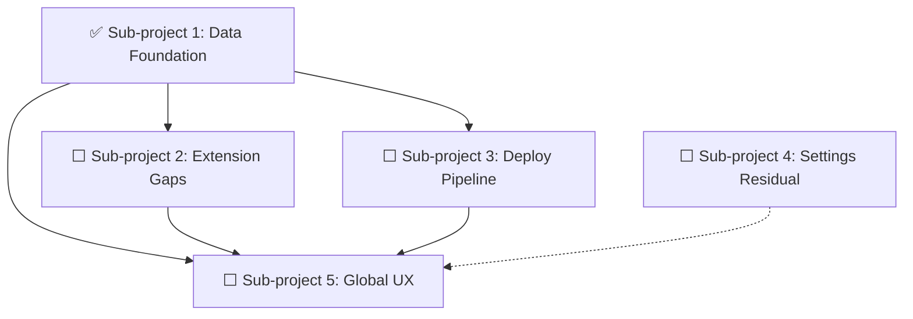

# Console — 남은 서브프로젝트 정리

> **기준:** 2026-07-30, 서브프로젝트 1 ("콘솔 데이터 기반화") 완료 후
> **커밋:** `292e909` (spec) + 구현 7개 커밋
> **이전 문서:** `docs/superpowers/specs/2026-07-30-console-shell-redesign.md` (shell + 6페이지 골격),
> `docs/superpowers/specs/2026-07-30-console-data-foundation-design.md` (P13+P11+P7+P10 기반)

## 완료된 작업 (Sub-project 1)

| 원본 Phase | 작업 | 파일 |
|-----------|------|------|
| P13 | `GET /stats`, `GET /content/recent`, `DELETE /sites/{slug}`, `PUT /config` 확장(integrations·languages) | `per_site.rs`, `sites_runtime.rs`, `router.rs` |
| P11 | 대시보드 — 단일 stats 쿼리, storage·last-build 카드, 교차 확장 recent 목록 | `DashboardPage.tsx` |
| P7 | 7개 콘텐츠 탭 검색 — `useRowFilter` 디바운스 클라이언트 필터 | `useRowFilter.ts`, 7개 `*Tab.tsx` |
| P10 | Settings — integrations 편집, languages 칩 에디터, Danger Zone 사이트 삭제 | `SettingsPage.tsx` |

---

## 남은 작업

### Sub-project 2: Extension 기능 완성 (P8)

**의존성:** Sub-project 1의 엔드포인트 위에 구축 (stats·recent 참조 불필요).
**난이도:** 중. 확장별로 다른 스키마.

| 항목 | 필요 작업 |
|------|----------|
| **Novels chapter CRUD** | 현재 `NovelsTab.tsx`는 소설 목록만 관리. `novel_chapter` 테이블의 CRUD가 없음. 새 tab 또는 drawer 내 chapter 리스트 + 생성/편집/삭제. 엔드포인트는 `POST/PATCH/DELETE /extensions/novels/{id}/chapters` 형태로 `oxibuilder-ext-novels`에서 제공돼야 함. |
| **Movies series groups** | `movie_entry`에 `series_group_id` FK 있으나 UI 없음. 그룹 생성/편집/멤버 관리. `series_group` 테이블 CRUD. |
| **Projects screenshots** | `screenshot` 테이블 존재 (`project_id, url, alt, display_order`). ProjectsTab에 스크린샷 업로드/순서 관리 UI. |
| **WASM extension install** | WASM 확장(`oxibuilder-core`의 `WasmLoader`)을 console에서 설치/관리하는 UI. 현재 CLI 전용. |

**참고 파일:**
- `web/src/admin/content/NovelsTab.tsx`
- `web/src/admin/content/MoviesTab.tsx`
- `web/src/admin/content/ProjectsTab.tsx`
- `crates/oxibuilder-ext-novels/src/` (routes.rs, repo.rs — 챕터 엔드포인트 확인)
- `crates/oxibuilder-ext-movies/src/` (시리즈 그룹 엔드포인트 확인)
- `crates/oxibuilder-core/src/extension.rs` (WasmLoader)

---

### Sub-project 3: Deploy 파이프라인 강화 (P9)

**의존성:** 없음 (기존 `build_post`/`deploy_post` 사용).
**난이도:** 중-상 (SSE 스트리밍).

| 항목 | 필요 작업 |
|------|----------|
| **Build log streaming** | 현재: build 완료 후 `build_log` INSERT만. 필요: 빌드 진행상황을 SSE(`text/event-stream`)로 클라이언트에 스트리밍. `POST /build`가 `Channel<BuildEvent>`를 열고, `GET /build/stream`이 SSE로 푸시. DeployPage에서 실시간 로그 표시. |
| **Deploy action** | 현재 `deploy_post`는 **stub** (`"Deploy is currently invoked via \`oxibuilder deploy --site <slug>\`"` 반환). `oxibuilder deploy` CLI 로직을 console 라우트로 포팅. |
| **Trigger UX** | DeployPage의 Build/Deploy 버튼 → 로그 스트리밍 표시 → 결과. 빌드 중 버튼 비활성화, 프로그레스 인디케이터. |

**참고 파일:**
- `crates/oxibuilder-console/src/per_site.rs` (build_post, deploy_post)
- `crates/oxibuilder-console/src/build/site_build.rs`
- `crates/oxibuilder-console/src/deploy/site_deploy.rs`
- `web/src/admin/deploy/DeployPage.tsx`

**기술 노트:**
- SSE는 `axum::response::sse::Sse` 사용. 기존 의존성에 `axum-extra` 필요할 수 있음.
- 빌드는 동기 blocking 작업 (`oxibuilder_core::build::build_site`). `tokio::task::spawn_blocking`에서 실행 + 채널로 진행도 전송.

---

### Sub-project 4: Settings 잔여 (P10 나머지 + 버그)

**의존성:** 없음. 독립적.
**난이도:** 하.

| 항목 | 필요 작업 |
|------|----------|
| **"Purge All Data" 활성화** | 현재 `disabled`. 모든 콘텐츠 테이블 truncate? 위험. 설계 논의 필요. v2.0 이후로 미룰 수 있음. |
| **`set_default` stub 수정** | `router.rs:set_default`가 `{"ok":true}` 반환. 실제로 sites.toml의 `default_site`를 변경해야 함. |

---

### Sub-project 5: Console Global UX (P12 + P14)

**의존성:** Sub-project 1-3 완료 후가 이상적 (모든 페이지가 실제 데이터를 표시할 때 UX 조정).
**난이도:** 하-중.

| 항목 | 필요 작업 |
|------|----------|
| **Tablet 반응형** | 현재 sidebar 200px 고정. `<md:`에서 sidebar hamburger 메뉴로 전환. Topbar 요소 wrap. |
| **SiteSelector info panel** | SiteSelector 드롭다운에 사이트 URL·last build 상태·content count 표시. |
| **Offline indicator** | `navigator.onLine` 감지 → 상단 배너. TanStack Query의 `networkMode`와 연동. |
| **Scroll reset** | 페이지 전환 시 `<main>` 스크롤 위치 리셋. React Router `<ScrollRestoration>` 사용. |
| **build_log `finished_at`** | `build_log` 테이블에 `finished_at TEXT` 컬럼 추가. `build_post`에서 build 종료 시 UPDATE. stats 응답에서 사용. |
| **Console tokens CSS variables** | 현재 console은 `bg-canvas`/`text-foreground`/`border-line` 같은 CSS 변수 사용 중. 일부 하드코딩된 값(예: sidebar `#1a1e24`) 확인. 새로운 design system(v2) 변수로 정리. |
| **Markdown preview** | Drawer 에디터의 `<Textarea>` 옆에 markdown 미리보기 탭. `marked` 또는 간단한 렌더러. 모든 content tab의 body editor에 적용. |

**참고 파일:**
- `web/src/admin/shell/Sidebar.tsx`, `Topbar.tsx`
- `web/src/admin/shell/SiteSelector.tsx`
- `web/src/admin/shared/ui/` (new components: MarkdownPreview, OfflineBanner)
- `crates/oxibuilder-console/src/per_site.rs` (build_post — `finished_at` UPDATE)

---

## 의존성 그래프



Sub-project 4와 5는 병렬 가능. Sub-project 2와 3은 S1 위에서 독립적으로 진행 가능.

---

## 파일 맵 (전체)

```
미변경 파일 (첫 서브프로젝트 완료 후 상태):
crates/oxibuilder-console/src/
├── per_site.rs              # +stats_get, +recent_get, config_put 확장됨
├── router.rs                # +delete_site handler + route
└── sites_runtime.rs         # +remove_site

web/src/admin/
├── shared/
│   ├── api.ts               # +getStats, +getRecent, updateConfig 확장됨
│   └── useRowFilter.ts      # 신규
├── dashboard/DashboardPage.tsx   # stats/recent 사용
├── settings/SettingsPage.tsx     # integrations/languages/danger zone
└── content/*Tab.tsx             # search 와이어링됨

향후 변경 대상 (Sub-project 2-5):
crates/oxibuilder-console/src/
├── per_site.rs              # build finished_at, SSE channel
├── build/site_build.rs      # 진행도 콜백/채널
└── deploy/site_deploy.rs    # 실제 deploy 로직

web/src/admin/
├── shell/Sidebar.tsx        # 반응형
├── shell/SiteSelector.tsx   # info panel
├── content/NovelsTab.tsx    # chapters CRUD
├── content/MoviesTab.tsx    # series groups
├── content/ProjectsTab.tsx  # screenshots
├── deploy/DeployPage.tsx    # SSE 스트리밍
└── shared/ui/               # MarkdownPreview, OfflineBanner
```
