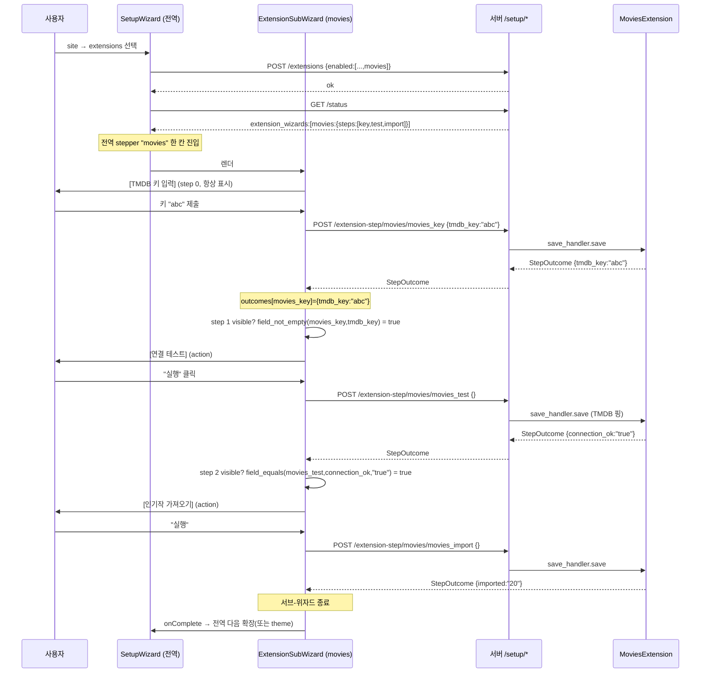

# 확장 소유 조건부 서브-위자드 (Extension-Owned Conditional Sub-Wizards)

- **상태**: 디자인 (사용자 리뷰 대기)
- **작성**: 2026-07-29
- **대상 버전**: v2 SSG (현재 작업 트리 기준)
- **우선순위**: High
- **선행 문서**: `docs/superpowers/specs/2026-07-29-extension-native-treatment-design.md` (본 문서가 §2.2 비목표를 해제·확장)
- **관련 코드**:
  - `crates/oxibuilder-core/src/extension.rs` (트레이트 + `SetupStep`/`SetupField` 타입)
  - `crates/oxibuilder-core/src/setup.rs` (setup API 핸들러)
  - `web/src/setup/` (위자드 프론트엔드)
  - `crates/oxibuilder-core/tests/setup_wizard.rs` (통합 테스트)

---

## 1. 배경

### 1.1 이미 동작하는 것

"활성화할 확장에 따라 step이 늘고 줄어드는" 동작은 **이미 구현돼 있다**:

- `setup_status_handler` (`setup.rs:281-330`)는 **활성 확장만** `extension_steps` / `external_api_keys`에 포함한다 (`registry.is_active` 게이트).
- `SetupWizard.tsx:152-158` — `StepExtensions`에서 "다음"을 누르면 `submitExtensions` 직후 `fetchSetupStatus()`를 재호출해 `buildSteps`가 step 목록을 재조립한다.
- 결과: profile을 끄면 profile step이 사라지고, movies를 켜면 movies의 키가 나타난다.

### 1.2 진짜 갭

현재 각 확장은 setup step을 **최대 1개**만 가질 수 있다 (`Extension::setup_wizard_step(&self) -> Option<SetupStep>`, 단수). 실제로 form step을 내는 건 `profile` **하나뿐**이고, movies/books/activity는 자기 API 키를 **모든 확장이 공유하는 단일 `external-keys` step**에 평탄화해서 넣는다 (`setup.rs:497-524`). 그래서 movies를 선택해도 "movies 전용 step"이 생기는 게 아니라 공유 키 페이지에 한 줄만 추가된다.

이 1-step 제한은 의도적이었다 — 선행 문서 §2.2에서 "step 개수/이름 자유화는 범위 밖"으로 명시한 비목표. **본 작업이 정확히 그때 미뤄둔 기능을 구현한다.**

### 1.3 사용자 요구 (2026-07-29)

> "활성화할 확장을 선택한 것에 따라 단계가 추가되거나 줄어들거나 해야지. 각각의 확장은 자신만의 마법사가 있을거야."

두 가지 설계 결정을 통해 방향을 확정했다:

1. **구조**: 그룹화 서브-위자드 — 각 확장이 자기 step 묶음을 "소유"하고 전역 플로우에서 한 블록으로 렌더된다.
2. **깊이**: 조건부 step 포함 — step이 이전 step 결과에 따라 보임/숨김된다 (예: movies = `TMDB 키 → 연결 테스트 → 인기작 가져오기`, 여기서 테스트/가져오기는 직전 결과에 따라 조건부).

두 결정에서 자동으로 귀결되는 **세 번째 결정**: 공유 `external-keys` step을 **폐지**하고 각 확장의 키를 자기 위자드 안의 필드로 흡수한다. "자기 마법사" 모델에서 공유 키 step은 모순이기 때문.

---

## 2. 목표 / 비목표

### 2.1 목표

- 각 확장이 **0..N개의 step**으로 구성된 자기 위자드를 소유한다 (`Vec<SetupStep>`).
- 서브-위자드 내 step은 **선언적 가시성 규칙**으로 조건부 표시된다.
- 각 확장의 외부 API 키는 자기 위자드의 한 필드(`Secret`)가 되며, 공유 키 step은 사라진다.
- 전역 위자드는 확장을 **그룹 단위**로 한 칸에 표시한다 ("자기 마법사" 체감).
- 기존 핵심 부품(`SetupField` 스키마, `GenericStep` 동적 렌더, `seed_sample_data`, loopback 게이트, `persist_extension_config`)을 **재사용**한다.

### 2.2 비목표

- 서브-위자드 **부분 진행의 서버 영속화**. 새로고침하면 위자드가 처음부터 재시작한다 — 이는 오늘과 동일한 parity (`get_completed_steps`는 코어 step만 추적, `setup.rs:131-133`). 코어 step(site/extensions/theme)은 영속 유지.
- **WASM 확장의 setup 위자드**. v1은 컴파일 확장만 (선행 문서 §2.2와 동일).
- 다국어 위자드 크롬 (ko/en 토글 자체).
- 중첩-속-중첩 서브-위자드 (1-depth 그룹만).
- 필드 수준의 복잡한 검증 규칙 엔진 (기존 `required` 불린 유지).

---

## 3. 설계 결정 요약

| # | 결정 | 근거 |
|---|------|------|
| D1 | `setup_wizard_step() -> Option<SetupStep>` → `setup_wizard() -> Option<ExtensionWizard { steps: Vec<SetupStep> }>` | 확장이 N개 step을 소유 |
| D2 | `SetupStep`에 `visible_when: Option<VisibilityRule>` 추가; **클라이언트가 평가** | 서버는 멍청하게, 매 step 재폴링 회피 |
| D3 | `SetupSaveHandler::save`가 `StepOutcome` 반환; 후속 step 가시성/프리필에 쓰임 | 조건부의 핵심 — 직전 결과를 다음 step이 참조 |
| D4 | `SetupFieldKind::Secret` 추가; `external_api_keys()`/`save_external_key()`/`ExternalApiKey`/`ExternalKeyScope` **폐지** | 키가 각 확장 위자드의 필드로 흡수 |
| D5 | 가시성 평가는 **선언적 규칙**(직렬화 가능)을 클라이언트가 평가; 서버 구동 클로저는 기각 | 클로저는 직렬화 불가 → 매 step `/setup/status` 재폴링 → UX 단절 |

---

## 4. 코어 타입 변경 — `crates/oxibuilder-core/src/extension.rs`

### 4.1 트레이트 (D1, D4)

```rust
pub trait Extension: Send + Sync {
    // …기존 메서드 (id, display_name, migrations, routes, lobby_summary,
    //    background_jobs, cli_commands, public_pages, table_names, on_startup, on_disable 등)…

    /// setup 마법사에서 이 확장이 소유할 서브-위자드.
    /// None이면 위자드에 등장하지 않는다 (대부분의 확장).
    fn setup_wizard(&self) -> Option<ExtensionWizard> {
        None
    }

    // 기존 external_api_keys() / save_external_key() 는 제거 (D4 — 키가 위자드 필드로 흡수).

    /// setup 완료 시점에 시드할 샘플 데이터. 활성 확장에만 호출 (변경 없음).
    async fn seed_sample_data(&self, _ctx: &AppState) -> anyhow::Result<()> {
        Ok(())
    }
}

/// 한 확장이 소유한 서브-위자드.
pub struct ExtensionWizard {
    pub steps: Vec<SetupStep>,   // 0..N. 빈 vec = 참여 안 함과 동일.
}
```

### 4.2 `SetupStep` + 가시성 (D2, D3)

```rust
#[derive(Clone)]
pub struct SetupStep {
    pub id: &'static str,                  // 레지스트리 전역 유일 (예: "movies_key", "movies_test")
    pub title_ko: &'static str,
    pub title_en: &'static str,
    pub description_ko: &'static str,
    pub description_en: &'static str,
    pub fields: Vec<SetupField>,           // 빈 vec = action step (버튼만, §4.4)
    pub save_handler: Arc<dyn SetupSaveHandler>,
    pub prefill: BTreeMap<&'static str, PrefillSource>,   // 기존 그대로 (PrefillSource::SiteName)
    pub visible_when: Option<VisibilityRule>,   // NEW. None = 항상 표시
}

/// 선언적 가시성 규칙. 클라이언트가 평가한다 (서버는 그냥 직렬화해 내려줌).
/// 모든 참조는 "다른 step이 반환한 StepOutcome.values의 키"를 가리킨다.
#[derive(Debug, Clone, serde::Serialize)]
#[serde(tag = "kind", rename_all = "snake_case")]
pub enum VisibilityRule {
    /// {step_id}의 outcome {field} 가 존재하고 비어있지 않은 문자열이면 표시
    FieldNotEmpty { step_id: &'static str, field: &'static str },
    /// {step_id}의 outcome {field} == {value} 이면 표시
    FieldEquals  { step_id: &'static str, field: &'static str, value: &'static str },
    All(Vec<VisibilityRule>),
    Any(Vec<VisibilityRule>),
}
```

### 4.3 저장 핸들러가 결과를 반환 (D3)

```rust
/// 코어가 form JSON을 받아 확장에 위임. 확장이 자기 DB에 쓰고,
/// **후속 step의 가시성/프리필에 노출할 값을 반환한다.**
#[async_trait]
pub trait SetupSaveHandler: Send + Sync {
    async fn save(
        &self,
        ctx: &AppState,
        form: &serde_json::Map<String, serde_json::Value>,
    ) -> anyhow::Result<StepOutcome>;
}

/// step 저장 결과. 클라이언트는 이 값을 `{step_id → {field → value}}` 맵에 누적해
/// 이후 step의 visible_when / prefill 평가에 쓴다.
#[derive(Debug, Clone, Default, serde::Serialize)]
pub struct StepOutcome {
    pub values: serde_json::Map<String, serde_json::Value>,
}

impl StepOutcome {
    /// 폼 step의 기본 동작: 입력받은 form 값을 그대로 outcome으로 노출.
    pub fn from_form(form: &serde_json::Map<String, serde_json::Value>) -> Self {
        StepOutcome { values: form.clone() }
    }
}
```

> **기존 호환성**: `save` 시그니처가 `Result<()>` → `Result<StepOutcome>`로 바뀐다. 기존 `profile` 핸들러는 `StepOutcome::from_form(form)`을 반환하도록 한 줄 수정. `ExternalKeyScope::ExtensionConfig` 영속화는 `persist_extension_config`(`extension.rs:374-404`)을 그대로 호출하는 키-step 핸들러가 담당.

### 4.4 필드 종류 — `Secret` 추가 (D4)

```rust
#[derive(Debug, Clone, Copy, serde::Serialize)]
#[serde(tag = "type", rename_all = "snake_case")]
pub enum SetupFieldKind {
    Text,
    Textarea,
    Url,
    Secret,   // NEW — <input type="password">. 프리필/에코 금지. API 키용.
}
```

- **action step**: `fields`가 빈 step. `GenericStep`는 폼 대신 단일 "실행 →" 버튼을 렌더하고, 클릭하면 빈 form으로 `POST` 후 `StepOutcome`을 받아 다음 step으로 진행. (예: "연결 테스트", "활동 동기화")

### 4.5 status 응답용 직렬화 타입

```rust
/// 클라이언트에 직렬화되는 위자드 정보 (save_handler 제외).
#[derive(Debug, Clone, serde::Serialize)]
pub struct ExtensionWizardInfo {
    pub extension_id: String,
    pub display_name: ExtDisplayName,
    pub steps: Vec<ExtensionStepInfo>,   // 각 step에 visible_when 포함
}

#[derive(Debug, Clone, serde::Serialize)]
pub struct ExtensionStepInfo {
    pub id: String,
    pub title_ko: String,
    pub title_en: String,
    pub description_ko: String,
    pub description_en: String,
    pub fields: Vec<SetupField>,
    pub is_action: bool,                 // fields.is_empty()와 동일, 클라이언트 편의용
    pub visible_when: Option<VisibilityRule>,
}
```

---

## 5. API 변경 — `crates/oxibuilder-core/src/setup.rs`

### 5.1 `GET /api/console/setup/status` 응답

```rust
#[derive(Serialize)]
pub struct StatusResult {
    pub setup_mode: bool,
    pub completed_steps: Vec<String>,            // 코어 step만 (기존 그대로)
    pub available_extensions: Vec<ExtInfo>,
    pub available_themes: Vec<ThemeEntry>,
    pub extension_wizards: Vec<ExtensionWizardInfo>,   // 활성 확장만.
    //   기존 extension_steps + external_api_keys 를 이 하나로 대체.
}
```

`setup_status_handler`는 활성 확장을 `registry.iter()` 순회하며 `setup_wizard()`를 호출해 `ExtensionWizardInfo`를 조립. step 순서 = 확장이 반환한 `steps` vec 순서. **가시성 필터링은 하지 않는다** — 모든 step + 규칙을 내려주고 클라이언트가 평가.

### 5.2 라우트

| 상태 | 메서드 | 경로 | 동작 |
|------|--------|------|------|
| 유지 | GET | `/setup/status` | 위 §5.1 응답 |
| 유지 | POST | `/setup/site` | 사이트명 + base_url (코어 책임) |
| 유지 | POST | `/setup/extensions` | enabled 토글 (코어 책임). 이후 클라이언트가 status 재조회 |
| **변경(네임스페이스)** | POST | `/setup/extension-step/{ext_id}/{step_id}` | `{ext_id}` 확장의 `{step_id}` step `save_handler` 디스패치 → `StepOutcome` 반환 |
| 유지 | POST | `/setup/theme` | 테마 + 로비 레이아웃 (코어 책임) |
| 유지 | POST | `/setup/complete` | 활성 확장 `seed_sample_data` 호출 (변경 없음) |
| **삭제** | POST | `/setup/external-keys` | 키가 위자드 필드로 흡수됨 (D4) |

`setup_extension_step_handler` 동작:

1. `registry`에서 `ext_id`에 해당하는 **활성** 확장을 찾는다. 비활성 → 404 (status에 노출되지 않으므로 직접 POST도 거부 — 일관성, 기존 동작 유지).
2. 그 확장의 `setup_wizard().steps`에서 `step.id == step_id`인 step을 찾는다. 없으면 404.
3. `step.save_handler.save(&state, &form)` 호출 → `StepOutcome`.
4. `Json<DataEnvelope<StepOutcome>>` 반환.

---

## 6. 프론트엔드 — `web/src/setup/`

### 6.1 전역 step 조립

```tsx
type Step =
  | { type: "site" }
  | { type: "extensions" }
  | { type: "extension-wizard"; wizard: ExtensionWizardInfo }   // 확장당 한 칸
  | { type: "theme" }
  | { type: "done" };

function buildSteps(status: SetupStatus | null): Step[] {
  if (!status) return [];
  return [
    { type: "site" },
    { type: "extensions" },
    ...(status.extension_wizards ?? []).map(w => ({ type: "extension-wizard", wizard: w })),
    { type: "theme" },
    { type: "done" },
  ];
}
```

전역 stepper는 각 확장을 **display_name 라벨의 한 칸**으로 표시한다. (이전엔 step마다 한 칸이었음.)

### 6.2 신규 컴포넌트 `<ExtensionSubWizard>`

```
Props:
  wizard: ExtensionWizardInfo
  onSubmitStep: (stepId, form) => Promise<StepOutcome>
  onComplete: () => void        // 서브-위자드 전부 끝나면 전역 index +1
  onExitBack: () => void        // 첫 step에서 "← 이전" → 이전 전역 step
```

내부 상태:
- `stepIdx`: 서브-위자드 내 인덱스
- `outcomes: Map<stepId, Map<field, string>>`: 누적 step 결과
- `error?: string`: action step 실패 시 인라인 표시

흐름:
1. 현재 step의 `visible_when`을 `outcomes`로 평가. 거짓이면 `stepIdx++` 하며 다음 visible step으로 건너뜀.
2. visible step 렌더:
   - `is_action`이면 → 단일 "실행 →" 버튼 (또는 "연결 테스트"/"동기화" 등 step 제목 유도 버튼).
   - 아니면 → 기존 `GenericStep`으로 `fields[]` 렌더 (`Secret` → password input, 프리필 금지).
3. 제출 → `onSubmitStep(step.id, form)` → `outcomes[step.id] = outcome.values` 머지 → `stepIdx++` → 1번으로.
4. 마지막 visible step 이후 → `onComplete()`.

가시성 평가 함수 (클라이언트):
```ts
function evalRule(rule: VisibilityRule, o: Map<string, Map<string, string>>): boolean {
  const get = (sid: string, f: string) => o.get(sid)?.get(f) ?? "";
  switch (rule.kind) {
    case "field_not_empty": return get(rule.step_id, rule.field).trim() !== "";
    case "field_equals":    return get(rule.step_id, rule.field) === rule.value;
    case "all": return rule.all.every(r => evalRule(r, o));
    case "any": return rule.any.some(r => evalRule(r, o));
  }
}
```

### 6.3 `GenericStep` 확장

- `SetupFieldKind.Secret` → `<Input type="password" autocomplete="off">`, `initialValues`에서 무시.
- 빈 `fields` → action 버튼 (위 §4.4).
- 그 외(text/textarea/url/select/toggle)는 기존 동작 유지.

### 6.4 삭제

- `web/src/setup/ExternalKeysStep.tsx` — 공유 키 step 폐지 (D4).
- `api.ts`의 `submitExternalKeys` 제거; `submitExtensionStep` 경로를 `/extension-step/{ext_id}/{step_id}`로 변경, 반환형 `StepOutcome`.

---

## 7. 기존 확장 마이그레이션

| 확장 | 현재 | 새 서브-위자드 |
|------|------|----------------|
| **profile** | `setup_wizard_step` 1개 (form) | `[프로필 입력]` — 동일 필드, `StepOutcome::from_form` 반환. 위자드 1-step. |
| **movies** | `external_api_keys`: `tmdb_key` | `[TMDB 키(Secret)]` → `[연결 테스트(action, visible: movies_key.tmdb_key 비어있지 않음)]` → `[인기작 가져오기(action, visible: movies_test.connection_ok == "true")]`. 키 step의 save_handler가 `persist_extension_config("movies","tmdb_key",val)` + `std::env::set_var`. |
| **books** | `external_api_keys`: `aladin_key` | `[알라딘 키(Secret)]` → `[연결 테스트]` → `[베스트셀러 가져오기]` (movies와 동일 패턴) |
| **activity** | `external_api_keys`: `github_username` | `[GitHub 사용자명]` → `[활동 동기화(action, visible: activity_github.github_username 비어있지 않음)]` |
| **blog** | `seed_sample_data` only | 변경 없음 — 위자드 없음, `complete` 시 환영 글 seed 유지 |
| projects / links / novels / scraps | 없음 | 없음 |

> **키 저장 일관성**: movies/books/activity는 키를 `extension_state.config` JSON + process env에 저장 (기존 `ExternalKeyScope::ExtensionConfig` 동작). 각 확장의 키-step `save_handler`가 `persist_extension_config`를 직접 호출 — 코어는 여전히 키 이름을 모른다.

---

## 8. 데이터 플로우



---

## 9. 구현 단계화 (writing-plans 에서 task로 분해)

1. **Foundation (D1)**: `setup_wizard_step` → `setup_wizard`(Vec) 전환 + status 응답 `extension_wizards` + 프론트 그룹 렌더. **조건부 없이 모든 step 항상 표시.** 이 시점에서 profile만 1-step 위자드. 회귀 없음 입증 (기존 테스트 통과).
2. **키 흡수 (D4)**: `external_api_keys`/`save_external_key`/`ExternalApiKey`/`ExternalKeyScope` 폐지 + `Secret` 필드 종류 + movies/books/activity를 각자 1-step(키만) 위자드로 전환. 공유 `external-keys` step + `ExternalKeysStep.tsx` 삭제.
3. **조건부 가시성 (D2, D3)**: `visible_when` + `StepOutcome`(save 반환형 변경) + 클라이언트 평가기 + action step + `ExtensionSubWizard` 내부 네비게이션. movies/books/activity에 테스트/가져오기 action step 추가.

각 phase는 독립적으로 빌드·테스트·커밋 가능.

---

## 10. 테스트 전략

`crates/oxibuilder-core/tests/setup_wizard.rs` 확장 (기존 테스트는 새 시그니처로 갱신):

- **status 조립**: 활성 확장의 `extension_wizards`만 노출, 비활성은 제외 (기존 `disabled_extension_excluded_from_status` 회귀 유지).
- **다중 step**: 한 확장이 2+ step을 반환할 때 모두 `extension_wizards[].steps`에 순서대로 직렬화.
- **가시성 규칙 직렬화**: `visible_when`이 `field_not_empty`/`field_equals`/`all`/`any`로 올바르게 직렬화되는지 (와이어 포맷 고정).
- **네임스페이스 디스패치**: `POST /extension-step/{ext_id}/{step_id}` 가 올바른 확장·step에 도달; 비활성 확장 → 404; 알 수 없는 step_id → 404; `StepOutcome` 본문 반환.
- **action step**: 빈 form으로 POST해도 `save_handler` 호출 + outcome 반환.
- 프론트엔드: 가시성 평가 함수 단위 테스트 (`field_not_empty` 빈문자열 거짓, `field_equals` 일치/불일치, `all`/`any` 조합).

---

## 11. 알려진 한계 / 후속

- **부분 진행 비영속**: 위자드 도중 새로고침하면 처음부터 재시작 (코어 step은 영속). 후속: `setup_state`에 활성 확장별 완료 step 집합을 저장하고 status에 반영.
- **action step 동기 한계**: "가져오기" 같은 긴 작업은 동기 핸들러 안에서 실행. 후속: 백그라운드 잡(`background_jobs`)으로 옮기고 step은 "시작됨" outcome만 반환.
- **가시성 규칙 표현력**: `field_not_empty`/`field_equals` + `all`/`any`로 시작. 숫자 비교/정규식이 필요해지면 `VisibilityRule` 확장.
