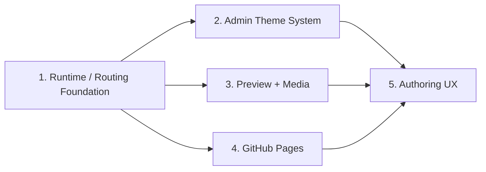

# Console Reliability and Publishing Suite — Design Index

> **Date:** 2026-07-31
> **Status:** Approved design; implementation planning not started
> **Scope:** oxibuilder console routing, Admin themes, static preview/media, GitHub Pages deployment, and extension authoring UX

## 1. Goal

Make the console reliable from direct navigation through publishing: `/sites` must always boot the current Admin bundle; console and public-site themes must have explicit ownership; uploaded media and built previews must work before deployment; GitHub Pages must support both root and project repositories; every built-in extension must offer validation and a faithful pre-publish preview.

This suite is split into five independently reviewable subprojects. A shared path/base contract lands first because preview, media, and GitHub Pages otherwise encode incompatible URLs.

## 2. Approved decisions

- Use a **shared runtime foundation followed by five bounded subprojects**, not isolated screen patches and not a generic extension-admin platform.
- Officially support both:
  - root Pages: `https://<owner>.github.io/`
  - project Pages: `https://<owner>.github.io/<repo>/`
- Keep the Admin SPA hosted at the loopback origin root; do not add an Admin `BrowserRouter` basename.
- Treat console appearance (`system | light | dark`) and the selected site's public `theme_id` as separate state.
- Use the actual public presentation components for unsaved draft preview.
- Keep explicit built-in extension editors; share primitives such as `ImageField`, `DraftPreviewPane`, and validators. Do not add `Extension::admin_forms()` in this suite.
- Keep GitHub authentication in the local `gh` CLI. Never store PATs or OAuth tokens in TOML, SQLite, or the browser.
- Custom domains/CNAME, a general media library, automatic image conversion, autosave, and content version history are out of scope.

## 3. Subprojects and dependency order



|Order|Spec|Independent deliverable|
|---|---|---|
|1|`2026-07-31-console-runtime-routing-foundation-design.md`|One served embed, deterministic deep links, canonical site paths, cache/error diagnostics|
|2|`2026-07-31-admin-theme-system-design.md`|Three-state Admin appearance, one theme catalog, theme-aware sidebar, site theme propagation|
|3|`2026-07-31-console-preview-media-design.md`|Working built-site preview plus safe image upload/live serving|
|4|`2026-07-31-github-pages-console-deploy-design.md`|Root/project Pages configuration, preflight, correct repository deploy, history|
|5|`2026-07-31-extension-authoring-ux-design.md`|Real unsaved preview, Profile admin, per-extension UX/validation fixes|

## 4. Cross-cutting path contract

Every registered site resolves paths exactly once:

```rust
pub struct SiteContext {
    pub slug: String,
    pub project_dir: PathBuf,
    pub data_dir: PathBuf,
    pub out_dir: PathBuf,
    pub media_dir: PathBuf,
    // config, db, registry, builders, operation guard
}
```

Resolution rules:

```text
project_dir = canonical registered site path
data_dir    = absolute config.server.data_dir,
              or project_dir.join(relative data_dir)
out_dir     = data_dir.join("out")
media_dir   = data_dir.join("media")
```

CLI build/deploy, console build/deploy, preview, and media upload consume these resolved paths. No operation derives a site repository or data directory from the process CWD.

## 5. Cross-cutting static base contract

A GitHub Pages target derives its deployment base:

```text
repo == "<owner>.github.io"  → "/"
otherwise                    → "/<repo>/"
```

The build writes `out/.oxibuilder-build.json`:

```json
{
  "build_id": "5a8b…",
  "deployment_base": "/oxibuilder-site/",
  "theme_id": "paper",
  "asset_revision": "4b57…",
  "built_at": "2026-07-31T02:00:00Z"
}
```

The live Admin bundle and public static bundle deliberately have different URL rules:

- Admin HTML remains root-hosted and uses path-absolute `/assets/...` URLs.
- Public static HTML uses `assets/...` relative URLs and includes a site-specific `<base href="...">` before every script/link that depends on it.
- `build_writer` materializes the public HTML from the static embed by removing the leading `/` from public asset tags. A global Vite relative base is not used because it would also change the Admin entry.
- Public `data/...` and `media/...` URLs resolve with `new URL(relativePath, document.baseURI)`.
- The public router derives its basename from `document.baseURI`.
- Preview rewrites only the public HTML `<base>` to its own prefix; because public asset tags are relative, the browser then requests preview-prefixed assets.

One `deployment_base` controls:

- public static JS/CSS assets,
- public React router basename,
- `data/*.json`,
- `media/*`,
- generated internal links and SPA shells,
- preview HTML base rewriting,
- deploy compatibility checks.

Canonical URLs remain derived from `site.base_url`, not from the HTML `<base>` element. Because custom domains are excluded, GitHub Pages preflight requires `site.base_url` to match the derived Pages URL and offers an explicit config update when it does not.

## 6. Feature ownership

|Concern|Owner|Persistence|Runtime effect|
|---|---|---|---|
|Admin appearance|shared browser theme controller|localStorage|Admin shell only|
|Public site theme|site-scoped theme API|site SQLite `theme_config`|public presentation, draft preview, static build|
|Built preview|build manifest + `out_dir`|filesystem|last successful static build|
|Draft preview|local form state|none until Save|single unsaved content item|
|Media source|site media service|`media_dir` filesystem; logical path in content row|Admin, draft preview, built preview, deployed site|
|Deploy target|per-site config|`oxibuilder.toml`|build base, preflight, deploy destination|
|Operation history|site DB|`build_log`, `deploy_log`|Dashboard and DeployPage|

## 7. Clean-cutover rules

- Only `crates/oxibuilder-core/embedded-spa` is served. The console crate's duplicate embed and copy build script are removed.
- Only site-scoped build/deploy routes under `/api/console/s/{slug}` remain. Legacy top-level build/deploy routes and the `site_deploy.rs` stub are removed.
- Only `SiteContext` resolved paths are used; old `<project>/out` assumptions are not retained as aliases.
- Public static URLs are relative to `document.baseURI`; root-absolute `/assets`, `/data`, and `/media` strings are removed from the public static path. Admin asset URLs stay absolute.
- The public theme catalog has one Rust source. Local TS catalogs and divergent validators are removed.
- Built-in admin editors stay explicit; no compatibility facade is added for a generic form manifest.

## 8. Requirement coverage

|Original requirement|Covered by|
|---|---|
|`/sites` raw HTML / SPA boot|Runtime foundation: reproduction, embed consolidation, cache policy, ErrorBoundary|
|Admin theme initialization/toggle/settings/sidebar|Admin theme system|
|Static site preview button/endpoint|Preview + media|
|GitHub Pages config, real deploy, status/history|GitHub Pages deploy|
|Draft preview, upload, Profile, form UX/validation|Authoring UX + preview/media foundation|

## 9. Suite-level acceptance

A release candidate is acceptable only when this browser flow succeeds without manual path edits:

```text
GET /sites directly
→ select a site
→ choose System/Light/Dark console appearance
→ select a public theme
→ upload a Profile or content image
→ preview an unsaved Profile and Blog form
→ build
→ open Preview Site
→ pass GitHub Pages project-repository preflight
→ stream deploy
→ open deployed URL and load assets, data, and media
```

The final verification must exercise a root Pages target and a project Pages target using temporary repositories/remotes; a narrowed unit test is not sufficient evidence for the base-path contract.
